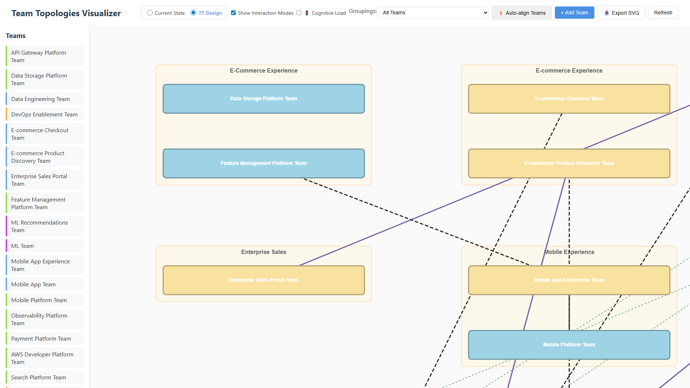

# Team Topologies Visualizer

A web application with dual visualization of organizational team structures. Visualize both your **current organizational state** and your **TT Design** (Team Topologies target design) to plan and communicate transformation initiatives.

> **Note**: This codebase was generated with AI assistance (GitHub Copilot / Claude Sonnet 4) as a learning project. Python and related technology choices were made as an opportunity to explore and learn these tools hands-on. Building this tool also serves as a way for the creator to gain deeper understanding of Team Topologies concepts through practical application.

## Screenshots

<div align="center">
  <a href="tests/tests/screenshots/current-state-view.png">
    
  </a>
  <a href="tests/tests/screenshots/tt-vision-view.png">
    
  </a>
  <br/>
  <em>Pre-TT (org hierarchy) and TT Design (value streams & platform groupings)</em>
</div>

## Quick Start

### Option 1: Local Python

1. **Setup**
   ```bash
   # Windows
   py -m venv venv
   .\venv\Scripts\activate
   pip install -r requirements.txt
   
   # Linux/Mac
   python3 -m venv venv
   source venv/bin/activate
   pip install -r requirements.txt
   ```

2. **Run**
   ```bash
   # With activated venv
   python -m uvicorn main:app --reload
   
   # Or direct path (Windows)
   .\venv\Scripts\python.exe -m uvicorn main:app --reload
   ```

3. **Open** http://localhost:8000/static/index.html

### Option 2: Docker/Podman

1. **Build**
   ```bash
   docker build -t team-topologies-viz .
   # or with Podman
   podman build -t team-topologies-viz .
   ```

2. **Run**
   ```bash
   docker run -p 8000:8000 -v ./data:/app/data team-topologies-viz
   # or with Podman
   podman run -p 8000:8000 -v ./data:/app/data:z team-topologies-viz
   ```
   
   **Windows PowerShell/Podman**: Use `${PWD}` instead of `./` and omit `:z`:
   ```powershell
   podman run -p 8000:8000 -v ${PWD}/data:/app/data team-topologies-viz
   ```

3. **Open** http://localhost:8000/static/index.html

The `-v` flag mounts your local `data/` directory so you can edit team files outside the container.

See [SETUP.md](docs/SETUP.md) for detailed installation and configuration instructions.

## Why This Tool?

When adopting Team Topologies, organizations need to:
- **Consolidate scattered information** - Unify team data from slides, documentation systems, spreadsheets, and other scattered sources into one structured, version-controlled format
- **Visualize the baseline** - Show how teams are currently organized (often by reporting lines, not value streams)
- **Design the future state** - Plan Team Topologies patterns (stream-aligned, platform, enabling, complicated subsystem, and undefined for teams in transition)
- **Communicate the transition** - Help everyone involved understand and discuss the "before and after"
- **Version-controlled history** - Git-friendly format enables tracking evolution over time (via git history)

This tool provides dual visualizations to make these conversations easier.

> **Note**: This tool applies Team Topologies principles developed by Matthew Skelton and Manuel Pais. See [Acknowledgments](#acknowledgments) for proper attribution.


## Key Features

- **📸 Evolution Tracking**: Create snapshots of your TT Design to track transformation progress over time. View historical states, compare quarterly changes, and show stakeholders your journey from "before" to "after". Snapshots are immutable, condensed JSON files perfect for audit trails and experimentation. See [Evolution Tracking documentation](docs/CONCEPTS.md#evolution-tracking-with-snapshots) for best practices.
- **Strict Team API template alignment**: All team markdown files now strictly follow the base Team API template section order and structure, including new product thinking sections where relevant.
- **URL-safe team names**: Team names with special characters (e.g. "/", "&") are now fully supported via a consistent slug system. Filenames and URLs use the same logic (e.g. "CI/CD Platform Team" → "ci-cd-platform-team").
- **Filename consistency**: All team markdown files use the slug format for filenames (e.g. `ci-cd-platform-team.md`).
- **Platform grouping fix**: Platform grouping boxes now always render and dynamically resize, even when teams are dragged far apart (removed stale position check).

- 📊 **Interactive Canvas** - Drag-and-drop teams, zoom (Ctrl+/- or mouse wheel), pan (right-click drag), fit-to-view (Ctrl+0)
- 🔍 **Search & Filter** - Instant team search (Esc to clear), multi-select filters for value streams and platform groupings (TT Design view)
- 🔄 **Dual Views** - Toggle between "Pre-TT" and "TT Design" (TT Design is default)
- 🎭 **Multiple Pre-TT Perspectives** - Visualize current state three ways:
  - **📊 Hierarchy**: Traditional org chart with line managers and departments
  - **🏭 Product Lines**: Hybrid layout with vertical product lanes + horizontal shared teams
  - **🌊 Value Streams**: Swimlane visualization showing teams grouped by value stream
- 📝 **Git-Friendly Storage** - Teams stored as markdown files with YAML front matter (structured metadata at the top of files between `---` delimiters, followed by markdown content)
- ✅ **File Validation** - "✓ Validate Files" button checks for YAML errors, missing fields, filename mismatches, team size issues, and more
- 🎨 **Customizable Team Types** - Define your own team classifications and colors via JSON config
- 🏢 **Organizational Context** - Line managers, departments, reporting structures with org-chart style visualization
- 📐 **Book-Accurate Team Shapes** (TT Design view) - Stream-aligned and Platform teams render as wide horizontal boxes (~80% of grouping width) matching Team Topologies book visualizations, stacking vertically to show flow alignment
- ⚡ **Auto-align Teams** - One-click alignment for both views:
  - **TT Design**: Organize teams within value stream and platform groupings with book-accurate shapes
  - **Pre-TT**: Align teams under line managers in org-chart layout
- 🎯 **Fractal Groupings** (TT 2nd edition) - Visual grouping of teams into Value Stream Groupings and Platform Groupings for team-of-teams patterns. Platform grouping boxes now always render and dynamically resize, even when teams are dragged far apart.
- � **Cognitive Load Indicators** - Optional traffic light visualization (🟢🟡🔴) showing team cognitive load levels
  - Toggle on/off to reduce visual clutter
  - Identify overloaded teams at a glance
  - Detailed breakdown of domain, intrinsic, and extraneous complexity
- �🔍 **Team Details** - Double-click for full team information with rendered markdown
- 📋 **Team API Compatible** - Uses Team Topologies Team API template format
- 📥 **SVG Export** - Export visualizations to SVG for presentations and documentation (respects connection visibility settings)
- 👁️ **Connection Toggles** - Control visual complexity:
  - **TT Design**: Show/hide interaction mode lines (shown by default, toggle off to reduce clutter)
  - **Pre-TT**: Show/hide communication lines (hidden by default for cleaner org-chart view)
- 🔄 **Refresh** - Reload all team files and configurations without losing canvas position

## Design Philosophy

### Structured Yet Simple
- Gather organizational data in a **structured but simple way**
- Easy visualization without complex database setup
- Focus on making data collection painless

### Version Control Friendly
- **Markdown files with YAML front matter** - easy to edit, review, and track changes
- Git-friendly format shows exactly what changed over time
- Human-readable without special tools

### Customizable
- Minimal dependencies (FastAPI, PyYAML, Markdown)
- Easy to fork and adapt for your organization
- Configurable team types and colors via JSON

## Project Structure

```
.
├── main.py                     # FastAPI app setup & route registration
├── requirements.txt
├── backend/                    # Modular backend architecture
│   ├── models.py              # Pydantic data models
│   ├── services.py            # File operations & business logic
│   ├── validation.py          # Team API validation & YAML checks
│   ├── snapshot_services.py   # Snapshot management for TT Design
│   ├── comparison.py          # Snapshot comparison logic
│   ├── routes.py              # Common API endpoints
│   ├── routes_pre_tt.py       # Pre-TT view endpoints (/api/pre-tt/*)
│   └── routes_tt.py           # TT Design view endpoints (/api/tt/*)
├── frontend/                   # HTML5 Canvas + vanilla JS (modular architecture)
│   ├── index.html
│   ├── styles.css
│   ├── app.js                 # Application coordinator
│   ├── state-management.js    # Centralized state management
│   ├── modals.js              # Modal dialogs & TT educational content
│   ├── legend.js              # Dynamic legend & filters
│   ├── ui-handlers.js         # UI event handling & controls
│   ├── filters.js             # Team filtering logic
│   ├── renderer.js            # Canvas rendering coordination
│   ├── constants.js           # Shared layout constants
│   ├── config.js              # API configuration
│   ├── notifications.js       # Unified notification system
│   ├── layout-utils.js        # Shared position calculations
│   ├── api.js                 # API client layer
│   ├── canvas-interactions.js # Canvas event handling
│   ├── renderer-common.js     # Shared rendering utilities
│   ├── renderer-current.js    # Pre-TT state rendering (Hierarchy view)
│   ├── renderer-product-lines.js      # Pre-TT Product Lines view
│   ├── renderer-value-streams.js      # Pre-TT Value Streams view
│   ├── svg-export.js          # SVG export functionality
│   ├── snapshot-handlers.js   # Snapshot management UI
│   ├── tt-comparison-view.js  # Side-by-side snapshot comparison
│   ├── current-state-alignment.js # Auto-align for Pre-TT view
│   ├── tt-design-alignment.js     # Auto-align for TT Design view
│   ├── tt-value-stream-grouping.js   # Value stream grouping logic
│   ├── tt-platform-grouping.js   # Platform grouping logic
│   ├── vitest.config.js       # Vitest test configuration
│   └── *.test.js              # Frontend unit tests (195 tests)
├── data/
│   ├── current-teams/         # Your pre-TT baseline state
│   │   ├── current-team-types.json    # Team type config
│   │   ├── organization-hierarchy.json # Org structure & line managers
│   │   └── *.md               # Team files
│   ├── tt-teams/              # Your TT Design vision
│   │   ├── tt-team-types.json         # Team type config
│   │   └── *.md               # Team files
│   └── snapshots/             # TT Design snapshots (immutable history)
│       └── *.json             # Timestamped snapshot files
├── tests_backend/             # Backend unit tests (55 tests with pytest)
│   ├── test_main.py
│   ├── test_team_api_fields.py
│   ├── test_url_safe_team_names.py
│   ├── test_interaction_table_parsing.py
│   └── test_snapshots.py
├── tests/                     # E2E tests with Playwright (82 tests)
│   ├── api-validation.spec.ts      # API endpoint validation
│   ├── organization-hierarchy.spec.ts  # Org hierarchy tests
│   ├── ui-basic.spec.ts           # Basic UI functionality
│   ├── ui-interactions.spec.ts    # User interaction tests
│   ├── modal-rendering.spec.ts    # Modal dialog tests
│   ├── backend-validation.spec.ts # Backend data validation
│   ├── tt-comparison-view.spec.ts # Snapshot comparison tests
│   ├── visualizer.spec.ts         # Core visualization tests
│   ├── pre-tt-product-lines.spec.ts # Product Lines view tests
│   └── playwright.config.ts       # Test configuration
└── docs/
    ├── SETUP.md               # Detailed setup & configuration
    ├── CONCEPTS.md            # TT concepts & example explanation
    └── svgs/                  # SVG assets for documentation
```

**Test Coverage**: 332 tests total (55 backend + 195 frontend + 82 E2E)

## Documentation

- **[SETUP.md](docs/SETUP.md)** - Installation, configuration, API reference, customization guide
- **[CONCEPTS.md](docs/CONCEPTS.md)** - Team Topologies concepts, example data explanation, use cases

## Quick Customization

1. **Edit team type definitions**: `data/current-teams/current-team-types.json`
2. **Add/edit teams**: Create or modify `*.md` files in `data/current-teams/` or `data/tt-teams/`
3. **Configure colors**: Update the `color` field in team type configs
4. **Drag teams on canvas**: Positions auto-save

See [SETUP.md](docs/SETUP.md) for detailed customization instructions.

## Current Limitations

- No create/update/delete via UI (intentional - edit markdown files directly)
- No authentication (single-user tool)
- No database (file-based storage)

These limitations keep the tool simple and git-friendly. Perfect for:
- Small to medium organizations
- Documentation and visualization
- Version-controlled team data
- Local exploration of Team Topologies

## Example Data

The repository includes a **fictitious organization** (FleetFlow Systems) for demonstration:
- Traditional team structure in Current State view
- SAFe/LeSS-inspired team classifications
- Team Topologies reorganization in TT Design view

**Note**: The example data shows **representative teams** to demonstrate core concepts, not a complete organization. In real transformations, team structures may change significantly (consolidation, splitting, new teams), and the number of teams before/after may differ.

**Disclaimer**: All example data is entirely fictitious. The creator has never worked in the logistics software industry. Technical details are made up for realistic demonstration purposes.

See [CONCEPTS.md](docs/CONCEPTS.md) for detailed explanation of the example organization and Team Topologies concepts.

## Usage

### Visualizing Teams

- The canvas displays all teams with color-coded boxes based on their type
- **Drag teams** to reposition them (positions are auto-saved)
- **Double-click teams** to view full details including description, dependencies, and metadata
- **Click teams** in the sidebar to select them
- **Zoom** using mouse wheel
- **Connections** between teams show interaction modes with different line styles
- **Auto-align Teams** - Click "⚡ Auto-align Teams" button to automatically organize teams:
  - **Current State view**: Positions teams under their line managers in org-chart layout
  - **TT Design view**: Arranges teams within value stream and platform groupings in a clean grid
  - Positions are automatically saved to team markdown files
- **Show Communication Lines** checkbox (Current State view) - Toggle communication lines on/off (hidden by default for cleaner org-chart view)
- **Show Interaction Modes** checkbox (TT Design view) - Toggle interaction mode lines (collaboration, X-as-a-Service, facilitating) on/off to reduce visual clutter when focusing on team structure
- **Interactive Legend** (TT Design view) - Click the ℹ️ icon next to any team type, interaction mode, or grouping in the legend to see educational modals explaining Team Topologies concepts
- **Cognitive Load Toggle** - Use the 🚦 **Cognitive Load** checkbox in the toolbar to show/hide cognitive load indicators:
  - Colored circle (🟢🟡🔴) appears in top-right corner of each team
  - Quickly identify overloaded teams at a glance
  - Double-click teams to see detailed breakdown (domain, intrinsic, extraneous complexity)
  - See [CONCEPTS.md](docs/CONCEPTS.md#cognitive-load-management) for detailed explanation
- **Groupings Filter** (TT Design view) - Filter teams by value stream or platform grouping to focus on specific areas
- **Refresh** button - Reload all team markdown files and configurations from disk without losing your zoom/pan position

### Validating Team Files

The **"✓ Validate Files"** button checks all team markdown files for common errors:
- YAML front matter syntax errors and duplicate blocks
- Missing required fields (name, team_type, position)
- Invalid team_type values
- Filename mismatches (e.g., file named `platform-team.md` but team name is "API Gateway Platform Team")
- Position coordinates validation
- Team size recommendations (warns if outside 5-9 people range)
- Interaction table format issues (TT Design view only)

**How to use:**
1. Click the **"✓ Validate Files"** button in the toolbar
2. Review the validation report showing summary statistics and detailed issues
3. Errors (red) must be fixed; warnings (yellow) are recommendations
4. Fix issues by editing the markdown files directly
5. Re-validate to confirm fixes

This helps catch errors before they cause rendering issues or API failures when editing team files manually.

### Comparing Snapshots

The **Snapshot Comparison View** allows you to visualize how your team topology has evolved over time by displaying two snapshots side-by-side with interactive controls.

**Creating Snapshots:**
1. Click the **"📜 Snapshots & Timeline"** button in the toolbar
2. Enter a descriptive snapshot name (e.g., "Q1 2024 State", "Post-Platform-Team-Creation")
3. Click **"📸 Take Snapshot"** to capture the current state
4. Snapshots are immutable JSON files stored in `data/snapshots/`

**Comparing Snapshots:**
1. Open the Snapshots panel
2. Select **two snapshots** using the checkboxes
3. Click **"🔄 Compare Snapshots"** to open the comparison view
4. The modal displays:
   - **Before** canvas (left) - Earlier snapshot
   - **After** canvas (right) - Later snapshot
   - **Changes summary** - Statistics of added, removed, moved, and type-changed teams
   - **Change badges** - Visual indicators on the "after" canvas:
     - 🟢 **NEW** (green) - Teams added since the before snapshot
     - 🟡 **MOVED** (yellow) - Teams repositioned
     - 🔵 **CHANGED** (blue) - Teams with changed types

**Interactive Features:**
- **Independent zoom/pan** - Each canvas has its own zoom controls (+ / - / Reset) and supports:
  - Mouse wheel zoom
  - Click-and-drag panning
- **Visibility toggles** - Three checkboxes to control what's displayed (all enabled by default):
  - **Show Groupings** - Value stream and platform grouping boxes
  - **Show Interactions** - Collaboration lines between teams
  - **Show Change Badges** - NEW/MOVED/CHANGED indicators
- **Automatic fit-to-view** - Both canvases automatically scale and center content when opened

**Use Cases:**
- Track quarterly transformation progress
- Communicate organizational changes to stakeholders
- Audit trail for compliance (immutable snapshot files)
- Experiment with different designs by comparing multiple "what-if" snapshots
- Present before/after views in executive presentations

See [CONCEPTS.md](docs/CONCEPTS.md#evolution-tracking-with-snapshots) for best practices on snapshot naming conventions and versioning strategies.

### Team Templates

This tool provides different templates for Pre-TT (current state) and TT Design (future state) teams.

#### Pre-TT Templates (Current Organizational State)

For teams in `data/current-teams/` - documents your current organization BEFORE Team Topologies transformation.

- **Pre-TT Team Template** (`templates/pre-tt-team-template.md`) - Captures current reality: reporting structures, departments, actual dependencies, pain points
  - Focus: `line_manager`, `department`, `dependencies`, `product_line`, current cognitive load challenges
  - Example: See `data/current-teams/engineering/backend-services-team.md`

#### TT-Design Templates (Team API Format)

For teams in `data/tt-teams/` - follows **Team API** format from the [official Team Topologies Team API template](https://github.com/TeamTopologies/Team-API-template). Documents your DESIGNED future state with Team Topologies patterns.

- **TT-Design Base Template** (`templates/tt-design-team-api-template-base.md`) - Minimal Team API, follows GitHub template exactly
  - Focus: `value_stream`, `platform_grouping`, interaction modes, service expectations
  - Example: See `data/tt-teams/observability-platform-team.md`
- **TT-Design Extended Template** (`templates/tt-design-team-api-template-extended.md`) - Comprehensive Team API with platform product thinking
  - Adds: Platform metrics, roadmap, customer problems, team members, detailed SLAs
  - Example: See `data/tt-teams/cloud-development-platform-team.md`

**Create your own company-specific template:**
- Start with base or extended template
- Add sections relevant to your industry (e.g., HIPAA compliance, SOC2 controls, audit trails)
- Copy sections you need from extended template
- Keep it focused - only add what helps teams interact effectively

See [CONCEPTS.md](docs/CONCEPTS.md#team-api-outward-facing-team-interface) for detailed explanation of Team APIs and when to use each template.

### Team Files

Teams are stored as markdown files with YAML front matter. Team types, colors, and descriptions are defined in prefixed configuration files within each view directory.

**Team Type Configuration** (`data/current-teams/current-team-types.json` or `data/tt-teams/tt-team-types.json`):
```json
{
  "team_types": [
    {
      "id": "feature-team",
      "name": "Feature Team",
      "description": "Small, cross-functional teams that own and deliver complete product features end-to-end.",
      "color": "#3498db"
    },
    {
      "id": "platform-team",
      "name": "Platform Team",
      "description": "Teams that own shared/core components and maintain the common foundation.",
      "color": "#27ae60"
    }
  ]
}
```

**Current State teams** (`data/current-teams/`) include:
```yaml
---
name: Core Product Team
team_type: feature-team            # Must match an id from current-team-types.json or tt-team-types.json
line_manager: Marcus Thompson      # Reports to (org hierarchy)
dependencies:
  - Database Platform Team
interaction_modes:
  Database Platform Team: collaboration
position:
  x: 300
  y: 200
metadata:
  size: 6
  department: Engineering
  product: RouteOptix
---

# Team description in markdown...
```

**Team Topologies teams** (`data/tt-teams/`) include:
```yaml
---
name: Mobile App Team
team_type: stream-aligned          # TT team type
dependencies:
  - Platform Team
interaction_modes:
  Platform Team: x-as-a-service    # TT interaction mode
position:
  x: 100
  y: 100
metadata:
  size: 8
---

# Team description in markdown...
```

## API Endpoints

The API provides **read-only endpoints** for visualization purposes:

- `GET /api/teams?view=current` - List all teams in current state
- `GET /api/teams?view=tt` - List all teams in TT vision
- `GET /api/teams/{name}?view=current` - Get a specific team
- `PATCH /api/teams/{name}/position?view=current` - Update team position on canvas (drag-and-drop)

**Note**: Create, update, and delete operations for team data are intentionally not implemented via API. Teams should be managed by editing the markdown files directly in `data/current-teams/` and `data/tt-teams/` folders. The PATCH position endpoint is the only write operation and only updates the x/y coordinates for canvas positioning.
## Linting

**CRITICAL**: Always run linters before committing to catch errors early.

### Python (Ruff)
```powershell
python -m ruff check backend/ tests_backend/ main.py --fix
```

**Common rules to avoid:**
- **F401**: Remove unused imports
- **B007**: Prefix unused loop variables with underscore (e.g., `for _key, value in items()`)
- **Trailing whitespace**: Auto-fixed with `--fix`

### JavaScript (ESLint)
```powershell
cd frontend
npm run lint            # Check for issues
npm run lint -- --fix   # Auto-fix issues
```

**Configuration:** See `ruff.toml` (backend) and `frontend/eslint.config.js` (frontend)
## Testing

The project includes comprehensive automated testing (332 tests total across 3 layers: backend unit, frontend unit, and E2E tests).

### Test Coverage
- **Backend**: 55 tests with pytest (~3.5s) - API validation, file parsing, URL-safe names, team API fields, snapshots, routes
- **Frontend**: 195 tests with Vitest (~5.6s) - Rendering, state, filters, groupings, SVG export, alignment, comparison view
- **E2E**: 82 tests with Playwright (~45s) - Full user workflows, UI interactions, canvas rendering, Pre-TT perspectives

### Coverage Reporting
- **Backend coverage**: 50% (pytest-cov) - HTML reports generated in `htmlcov/`
- **Frontend coverage**: Vitest with v8 provider - HTML reports in `frontend/coverage/`
- **CI Pipeline**: Coverage reports automatically uploaded as GitHub Actions artifacts (7-day retention)
  - Download `backend-coverage-report` and `frontend-coverage-report` from Actions runs
  - Also includes `playwright-report` for E2E test results

### Running Tests Locally

**Backend tests:**
```powershell
# Windows with venv (CORRECT way)
.\venv\Scripts\python.exe -m pytest tests_backend/ -v

# With coverage
.\venv\Scripts\python.exe -m pytest tests_backend/ --cov=backend --cov=main --cov-report=html --cov-report=term
```

**Frontend tests:**
```powershell
cd frontend
npm test                    # Run once
npm run test:watch          # Watch mode
npm run test:coverage       # With coverage
```

**E2E tests (Playwright):**
```powershell
cd tests
npx playwright test         # Run all E2E tests
npx playwright test --ui    # Interactive UI mode
```

**Run all tests:**
```powershell
.\run-all-tests.ps1         # Runs backend + frontend + E2E in sequence
```

**Note**: E2E tests automatically start/stop the uvicorn backend server on port 8000.

### E2E Testing Architecture

**Hidden DOM for Canvas State Testing**  
Since canvas-rendered content is difficult to test (no DOM representation), we implemented a hidden `#canvasTestState` div that mirrors the canvas state:

```html
<div id="canvasTestState" style="display: none;" 
     data-total-teams="34" 
     data-filtered-teams="12"
     data-active-filters='{"valueStreams":["E-commerce"]}'
     data-current-view="tt"></div>
```

This enables reliable assertions on canvas state without indirect UI checks:
- Verify exact filter counts
- Check which filters are active
- Validate view state
- Test search functionality

Updated automatically in `renderer.js` after each draw cycle.

**Test Organization**  
E2E tests are organized into focused, independent test files (40 tests total across 6 files):
- `api-validation.spec.ts` (3 tests) - API endpoints, JSON validation
- `organization-hierarchy.spec.ts` (9 tests) - Department structure, team counts
- `ui-basic.spec.ts` (9 tests) - Page load, views, canvas, legend
- `ui-interactions.spec.ts` (8 tests) - Filters (using hidden DOM), search, zoom, validation
- `modal-rendering.spec.ts` (1 test) - Modal content rendering
- `backend-validation.spec.ts` (1 test) - Backend file structure validation

See [DEVELOPMENT.md](DEVELOPMENT.md) for detailed testing instructions, development workflow, and technical decisions.

## Development

The server runs with hot-reload enabled for Python changes. For frontend changes, refresh your browser (Ctrl+Shift+R for hard refresh).

See [DEVELOPMENT.md](DEVELOPMENT.md) for full development guide including testing, debugging tips, and architecture decisions.

## Technologies

- **Backend**: FastAPI (Python)
- **Frontend**: HTML5 Canvas, Vanilla JavaScript
- **Markdown Rendering**: marked.js v14 (GitHub Flavored Markdown with XSS protection)
- **Data Storage**: Markdown files with [YAML front matter](https://jekyllrb.com/docs/front-matter/) (structured metadata between `---` delimiters at the top of files)
- **Visualization**: Interactive canvas with drag-and-drop
- **Dependencies**: uvicorn, pyyaml, markdown

### Why These Technologies?

**Python/FastAPI** was chosen for the backend primarily as a **learning exercise** and for its quick setup. FastAPI provides:
- Easy to get up and running quickly
- Automatic API documentation (via Pydantic models)
- Type hints for better code quality
- Simple file handling for markdown storage
- Great for prototyping and iteration

**Vanilla JavaScript** was chosen over TypeScript for the frontend:
- **No build step required** - Simplicity was prioritized for this relatively straightforward visualization app
- **Direct browser execution** - Edit and refresh workflow without compilation delays
- **Learning curve** - Easier for contributors familiar with basic JavaScript
- **TypeScript was evaluated** early in development but added more complexity than value for this project's scope
- For larger, team-based projects, TypeScript would be recommended, but for a single-maintainer learning project, vanilla JS proved more practical

**Note**: The implementation may evolve in the future. The architecture is designed to be flexible, and the backend could be replaced with other technologies (Node.js, Go, etc.) while keeping the same file-based storage approach.

**Markdown storage** was chosen for:
- Human-readable and editable
- Git-friendly (easy to track changes)
- No database setup required
- Compatible with Team API template format

## Future Enhancements

### Value Stream Visualization and Grouping (2nd Edition Focus)
The 2nd edition emphasizes **value stream grouping** and **platform grouping** as fractal organizational patterns. ✅ **Basic visual grouping is now implemented** - teams can be grouped by value stream (light yellow/orange) and platform grouping (light blue) in the TT Design view. Additional features to further support this mental model:

**Value Stream Mapping**
- **Value stream identification** - Define and visualize distinct value streams (customer-facing flows of value)
- **Stream-aligned team grouping** - Group multiple stream-aligned teams serving the same value stream
- **End-to-end flow visualization** - Show how value flows from customer need to delivered capability
- **Value stream health indicators** - Lead time, deployment frequency, team cognitive load per value stream
- **Cross-value-stream dependencies** - Identify and minimize dependencies between value streams
- **Value stream ownership** - Clearly assign executive ownership/sponsorship to each value stream

**Platform Grouping (Fractal Patterns)**
- **Platform as a team-of-teams** - Visualize platform groupings containing multiple platform teams working together
- **Platform capabilities map** - Show what capabilities each platform grouping provides
- **Platform consumption patterns** - Visualize which stream-aligned teams consume which platforms
- **Thinnest Viable Platform (TVP) tracking** - Document and visualize platform maturity and scope
- **Platform team cognitive load** - Monitor if platforms themselves are overloaded
- **Internal platform dependencies** - Show relationships between platform teams within a platform grouping

**Team-of-Teams Patterns**
- **Sensing organization view** - Visualize feedback loops and adaptation patterns
- **Team interaction evolution** - Timeline showing how team relationships change over time (collaboration → X-as-a-Service)
- **Temporary vs permanent structures** - Distinguish between stable long-term teams and temporary enabling/collaboration patterns
- **Multi-level groupings** - Support nested groupings (team → value stream grouping → portfolio → organization)

### Cognitive Load Management
- **Cognitive load assessment** - Visual indicators for team cognitive load (domain, instrinsic, extraneous)
- **Domain complexity mapping** - Tag teams with their domain complexity level
- **Responsibility mapping** - List and visualize all team responsibilities to identify overload
- **Cognitive load heatmap** - Color-code teams by their cognitive load status
- **Simplification opportunities** - Identify teams that could benefit from platform services or enabling support

### Team API and Boundaries
- **Team API visualization** - Display team APIs (expectations, dependencies, communication channels) on the canvas
- **Boundary clarity indicators** - Show how well-defined each team's boundaries are
- **API contract versioning** - Track evolution of team dependencies and interfaces over time
- **Expected behaviors documentation** - Link to detailed team working agreements and interaction expectations

### Flow Metrics and Sensing
- **Flow metrics per team** - Lead time, deployment frequency, MTTR, change fail rate
- **Bottleneck identification** - Visual highlighting of teams that slow down the value stream
- **Dependency wait time tracking** - Measure time spent waiting on other teams
- **Sensing loops** - Document feedback mechanisms teams use to sense environment changes
- **Team maturity indicators** - Show team capability levels and areas needing enabling support

### Architecture Visualization with Conway's Law
Integrate draw.io (or similar) based architecture diagrams to show:
- **Current technical architecture** alongside current organizational structure
- **Future technical architecture** alongside Team Topologies vision
- **Conway's Law relationships** - visual connections showing how team boundaries align (or misalign) with system boundaries
- **Transformation roadmap** - how organizational changes enable architectural changes and vice versa

This would help teams:
- Identify Conway's Law violations (team boundaries cutting across system boundaries)
- Plan aligned organizational and architectural transformations
- Communicate the relationship between team structure and system design
- Visualize the impact of Team Topologies patterns on technical architecture

### Additional Ideas
- **Nested value streams within platform groupings** - Support 2nd Edition pattern where value streams can exist within platform groupings (e.g., Developer Experience value stream within Cloud Infrastructure Platform Grouping). Would require hierarchical grouping rendering with nested bounding boxes and updated layout algorithms.
- **Visibility controls** - Toggle visibility of individual teams and departments in Current State view to focus on specific areas of the organization
- **Filtering by value stream** - Show only teams belonging to a specific value stream
- **Interaction mode timeline** - Show how team interaction modes change over time (Collaboration → X-as-a-Service)
- **Platform maturity progression** - Visualize platform evolution from MVP to mature service
- **Team stability tracking** - Visualize team membership stability and tenure
- **Multi-organization portfolio view** - Support visualizing team topologies across multiple companies/business units
- ASCII art export for documentation and presentations (clearer than trying to explain with words! 😄)
- Additional visualization layouts (value stream swim lanes, radial platform grouping view)
- Import team data from external sources (JIRA, Azure DevOps, ServiceNow)
- Real-time collaboration - Multiple users editing the same visualization
- Mobile-responsive design for viewing on tablets/phones

## Contributing

See [CONTRIBUTING.md](CONTRIBUTING.md) for guidelines on how to contribute to this project.

## License

MIT - see [LICENSE](LICENSE) file for details.

## Acknowledgments

This project implements concepts from **Team Topologies** by Matthew Skelton and Manuel Pais. The visualization tool is built to help organizations apply Team Topologies principles to their team structures.

**Key attributions:**
- **Team Topologies concepts** (4 team types, 3 interaction modes) © Matthew Skelton and Manuel Pais
- **Team API template format** based on [TeamTopologies/Team-API-template](https://github.com/TeamTopologies/Team-API-template) (CC BY-SA 4.0)
- This software implementation is original work released under MIT License

We are grateful to the Team Topologies community for their thought leadership and openly shared resources that inspired this visualization tool.

## References

**Core Resources:**
- [Team Topologies book and website](https://teamtopologies.com/) by Matthew Skelton and Manuel Pais - Book information and additional resources
- [Team API Template](https://github.com/TeamTopologies/Team-API-template) - Template format used for team files
- [Team Topologies Key Concepts](https://teamtopologies.com/key-concepts) - Overview of fundamental concepts
