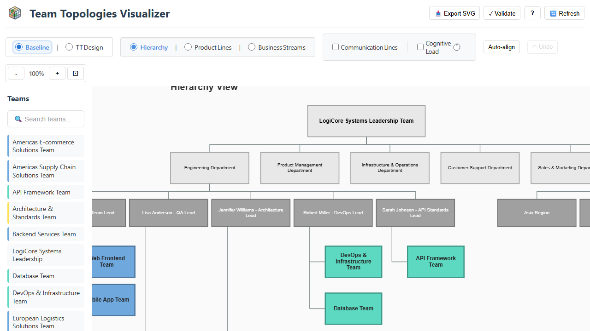
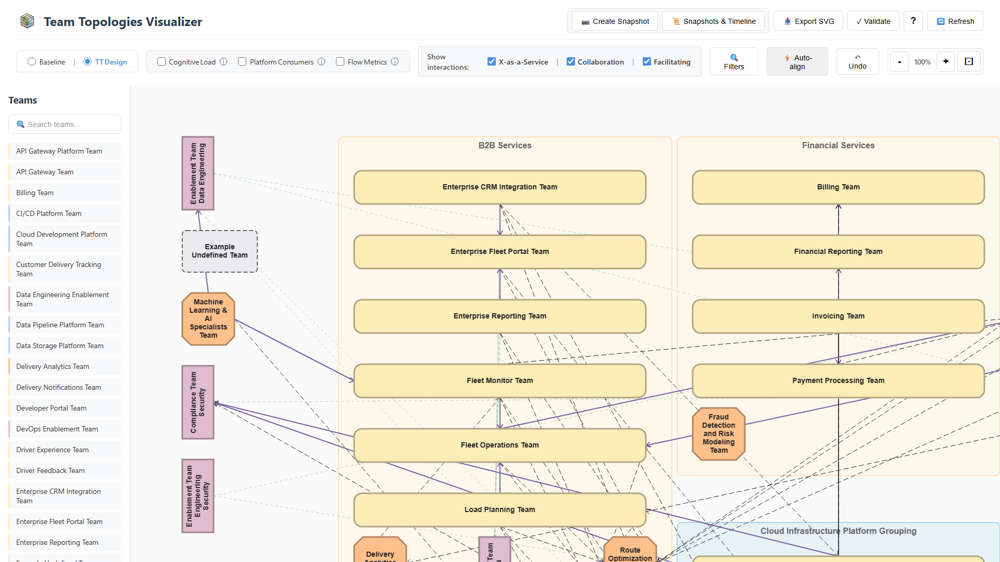

#  Team Topologies Visualizer

A web app for visualizing team structures using **Team Topologies (TT)** concepts.

Two complementary views:
- **Baseline**: your current/reference structure before Team Topologies transformation
- **TT Design**: your target Team Topologies design (team types, interaction modes, groupings)

See [docs/CONCEPTS.md](docs/CONCEPTS.md#the-tools-two-views) for view details and why these names.

This tool is inspired by **Team Topologies** by Matthew Skelton and Manuel Pais — especially the concepts summarized at https://teamtopologies.com/key-concepts (more references at the end of this README).

> **Note**: This project was built with extensive AI assistance (GitHub Copilot + Claude). As a non-native Python and JavaScript developer, this AI-driven co-creation approach enabled me to use tools and techniques — including FastAPI, Canvas rendering, and comprehensive test automation — in ways that would have taken much longer solo.

## Why This Tool?

What I wanted from a tool like this was something that helps when adopting Team Topologies:

- **Consolidate scattered information**: unify team data from slides, docs, and spreadsheets into a structured, git-friendly Markdown format
- **Visualize the baseline**: capture the "before" from multiple perspectives
- **Design the future state**: model team types, interaction modes, and groupings
- **Communicate (and keep evolving) the transition**: make the “before vs after” easy to discuss and iterate on continuously over time (snapshots + git history)

## Screenshots

<div align="center">
  <a href="tests/screenshots/current-state-view.png">
    
  </a>
  <a href="tests/screenshots/tt-vision-view.png">
    
  </a>
  <br/>
  <em>Baseline (org hierarchy) and TT Design (value streams & platform groupings)</em>
</div>

## Quick Start

**Note**: This tool was developed on Windows. Command examples use Windows syntax, but macOS/Linux equivalents are shown where they differ (e.g., venv activation).

### Local Python

```bash
# Windows
py -m venv venv
.\venv\Scripts\activate
python -m pip install -r requirements.txt
python -m uvicorn main:app --reload

# Linux/Mac  
source venv/bin/activate
python -m pip install -r requirements.txt
python -m uvicorn main:app --reload
```

Open http://localhost:8000/static/index.html

### Docker/Podman

```bash
docker build -t team-topologies-viz .
docker run -p 8000:8000 -v ./data:/app/data team-topologies-viz
```

Open http://localhost:8000/static/index.html

**Full setup instructions**: See [docs/SETUP.md](docs/SETUP.md) for detailed installation, configuration, Docker/Podman options, demo mode, and TT design variants.

## Key Features

### Two Complementary Views
- **Baseline**: Visualize your current organization structure from three perspectives:
  - **Hierarchy**: classic org chart with reporting lines
  - **Product lines**: product lanes with shared teams
  - **Business streams**: swimlanes grouped by business value streams (e.g., SAFe "trains")
- **TT Design**: Model your target Team Topologies structure with:
  - Four team types (Stream-aligned, Platform, Enabling, Complicated Subsystem)
  - Three interaction modes (Collaboration, X-as-a-Service, Facilitating)
  - Value stream groupings and platform groupings (TT 2nd ed.)

### Visualization & Interaction
- **Interactive canvas**: drag-and-drop teams, zoom, pan, fit-to-view
- **Auto-align**: intelligent positioning based on flow of change with optional alignment hints
- **Team details**: open full team information with rendered Markdown
- **SVG export**: export views for documentation and presentations

### Team Topologies Evolution
- **Snapshots**: save versions of your TT design to track progress over time
- **Comparison view**: side-by-side comparison of snapshots showing changes
- **Team API compatible**: Markdown + YAML front matter, aligned to the [Team API template](https://github.com/TeamTopologies/Team-API-template)

### Customization & Quality
- **Flexible configuration**: adapt team types, colors, and org structures to your context
- **Validation**: YAML error checking and basic consistency checks
- **Optional metrics**: cognitive load indicators and DORA-style flow metrics

## Documentation

**Root folder** = quick reference (README, CONTRIBUTING)  
**docs/ folder** = in-depth guides and documentation:

| Document | Description |
|----------|-------------|
| [docs/SETUP.md](docs/SETUP.md) | Installation, configuration, Docker/Podman, demo mode, TT variants |
| [docs/CONCEPTS.md](docs/CONCEPTS.md) | Team Topologies concepts and how they map to the tool |
| [docs/EXAMPLE_DATA.md](docs/EXAMPLE_DATA.md) | Example organization, transformation story, dataset variants |
| [docs/AUTO-ALIGN.md](docs/AUTO-ALIGN.md) | Auto-align feature, alignment hints, 3×2 grid layout |
| [docs/DEVELOPMENT.md](docs/DEVELOPMENT.md) | Developer workflow, testing, linting |
| [docs/TESTING.md](docs/TESTING.md) | Comprehensive testing guide (pytest, Vitest, Playwright) |
| [docs/ARCHITECTURE.md](docs/ARCHITECTURE.md) | Technical architecture, design decisions, code structure |
| [docs/DEPENDENCIES.md](docs/DEPENDENCIES.md) | Full dependency list and rationale |
| [docs/BACKLOG.md](docs/BACKLOG.md) | Feature ideas and priorities |
| [docs/CHANGELOG.md](docs/CHANGELOG.md) | Design decisions and implementation notes |

## Quick Customization

```bash
# Edit team files
data/current-teams/**/*.md    # Baseline teams
data/tt-teams/**/*.md         # TT design teams (or tt-teams-initial/)

# Configure team types and colors
data/current-teams/current-team-types.json
data/tt-teams/tt-team-types.json
```

Want to understand the team Markdown/YAML structure (or create your own starting from [templates/](templates/))? See [docs/SETUP.md](docs/SETUP.md#data-organization).

## Example Data

Includes a fictitious organization (**LogiCore Systems**) to illustrate typical “before vs after” patterns during a Team Topologies adoption.

**Two TT design variants**: Mid-stage transformation (default, ~34 teams) and first-step transformation (optional, ~20 teams) showing realistic progression.

See **[docs/EXAMPLE_DATA.md](docs/EXAMPLE_DATA.md)** for the complete story, how to switch variants, and detailed comparison.

**Data Management**: All team data is stored as markdown files in `data/`. Use git for version control and backup - commit regularly to preserve your team topology designs.

**Disclaimer**: All example data (company/team/product names, technical details) is entirely fictitious for demonstration purposes.

## Testing

```bash
# Run all tests (Windows PowerShell)
pwsh ./scripts/run-all-tests.ps1
```

The test suite includes backend (pytest), frontend (Vitest), and E2E (Playwright) tests.

**Detailed test instructions**: See [DEVELOPMENT.md](docs/DEVELOPMENT.md#testing) for individual test commands, coverage options, and Windows-specific notes.

## Linting

```bash
# Python (Ruff)
python -m ruff check backend/ tests_backend/ main.py --fix

# JavaScript (ESLint)
cd frontend && npm run lint -- --fix
```

## Technologies

- **Backend**: Python 3.10+, FastAPI
- **Frontend**: HTML5 Canvas, Vanilla JavaScript (no build step)
- **Testing**: pytest, Vitest, Playwright
- **Data**: Markdown with YAML front matter

**Full dependency list and rationale**: See [DEPENDENCIES.md](docs/DEPENDENCIES.md)

## Contributing

See [CONTRIBUTING.md](CONTRIBUTING.md).

## License

MIT License - see [LICENSE](LICENSE).

## Acknowledgments

This tool applies Team Topologies concepts by Matthew Skelton and Manuel Pais.

- Book information and additional resources - https://teamtopologies.com/
- Team API Template: https://github.com/TeamTopologies/Team-API-template
- Team Shape Templates: https://github.com/TeamTopologies/Team-Shape-Templates
