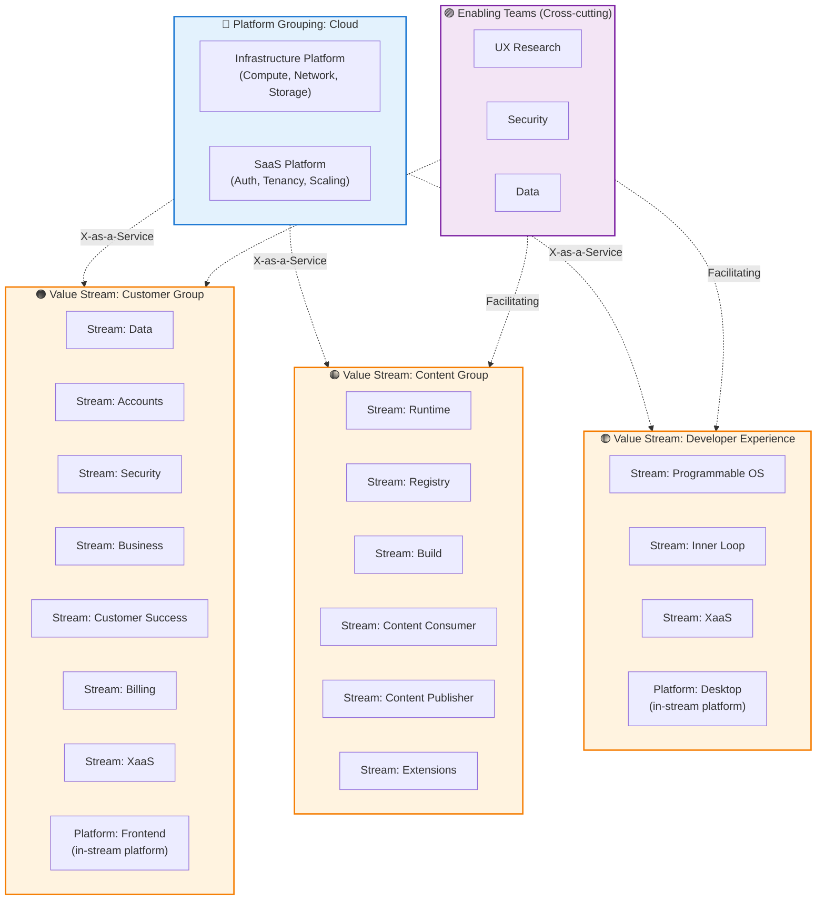
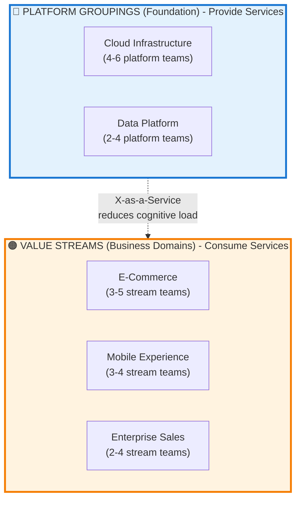

# Team Topologies Concepts and Examples

## Team Topologies Fundamentals

> **Note**: This section provides a brief overview of Team Topologies concepts. For comprehensive details and authoritative definitions, see the [Team Topologies book](https://teamtopologies.com/) by Matthew Skelton and Manuel Pais. Additional resources and references are available at the [bottom of this document](#references).

### The 4 Fundamental Team Types

> **Note**: Team type colors in this tool align with Team Topologies book 2nd edition visualizations.

- **Stream-aligned** (Orange): Aligned to a single, valuable stream of work (e.g., a specific user journey, product, or feature set). Primary team type that delivers value directly to customers.
- **Platform** (Blue): Provides internal services to reduce cognitive load of stream-aligned teams (e.g., APIs, infrastructure, deployment pipelines). Enables stream-aligned teams to deliver faster.
- **Enabling** (Purple): Helps stream-aligned teams overcome obstacles and adopt new technologies (e.g., coaching, mentoring, new practices). Temporary collaboration to upskill other teams.
- **Complicated Subsystem** (Light Red): Deals with complex technical domains requiring specialist knowledge (e.g., ML algorithms, video processing, mathematical models). Reduces cognitive load on stream-aligned teams.

### Team Shape Visualization (TT Design View)

Based on the [official Team Topologies Shape Templates](https://github.com/TeamTopologies/Team-Shape-Templates), teams are rendered with different widths to reflect their relationship to the flow of change:

#### Wide Teams (Stream-aligned & Platform)
- **Visual style**: Wide horizontal boxes (~80% of grouping width) stacked vertically
- **Rationale**: These teams support the **"whole flow of change"** from idea to production
  - **Stream-aligned teams** own end-to-end slices of the business domain with no hand-offs
  - **Platform teams** provide foundational services that accelerate multiple streams
- **From TT Shape Templates**: "Stream-aligned and Platform teams will typically be re-sized horizontally. They may increase in size vertically to indicate the size of the team relative to others."
- **Key insight**: The wide shape emphasizes these teams' responsibility for complete, autonomous delivery

#### Narrow Teams (Enabling & Complicated Subsystem)
- **Visual style**: Standard-width boxes arranged in a grid (3 per row)
- **Rationale**: These teams have **focused, specialized responsibilities**
  - **Enabling teams** provide temporary, focused support to specific teams
  - **Complicated Subsystem teams** handle specific complex domains
- **Positioning**: Located below wide teams to show their supporting nature

This visualization directly reflects the Team Topologies book's diagrams where stream-aligned teams span horizontally across value streams, while enabling and subsystem teams are positioned around them as needed.

### The 3 Interaction Modes

Team interaction modes define **how teams work together** and evolve over time. Each mode has specific characteristics and use cases:

#### Collaboration
- **Visual**: Solid purple line in this tool
- **Definition**: Two teams working closely together for a defined period with high interaction and joint responsibility
- **When to use**: 
  - Discovery and rapid learning phases
  - Building new systems or capabilities together
  - Exploring uncertain or complex problem spaces
  - Teams need to build shared understanding
- **Expected behaviors**: Daily communication, joint planning, shared goals, overlapping responsibilities
- **Evolution**: Should be **temporary** - transition to X-as-a-Service once interfaces stabilize
- **Warning signs**: If collaboration becomes permanent, it may indicate unclear boundaries or excessive coupling

#### X-as-a-Service
- **Visual**: Dashed near-black line in this tool
- **Definition**: One team consumes services from another with minimal collaboration through clear, well-defined APIs
- **When to use**:
  - Stable, well-understood interfaces exist
  - Provider team has mature capability
  - Consumer team needs autonomy
  - Clear service-level expectations
- **Expected behaviors**: Self-service consumption, minimal direct communication, versioned APIs, SLAs/documentation
- **Target state**: Most team interactions should **evolve toward this mode** for fast flow
- **Platform teams**: Typically interact via X-as-a-Service with stream-aligned teams

#### Facilitating
- **Visual**: Dotted green line in this tool
- **Definition**: One team (usually Enabling) helps another team adopt new practices, tools, or capabilities
- **When to use**:
  - Helping teams learn new technologies or practices
  - Reducing capability gaps
  - Upskilling teams
  - Temporary support during transitions
- **Expected behaviors**: Coaching, pairing, workshops, temporary embedded support, knowledge transfer
- **Duration**: **Always temporary** - enabling team moves on once capability is transferred
- **Enabling team pattern**: This is the primary mode for Enabling teams

**Key insight**: Interaction modes should **evolve over time**. Start with Collaboration for discovery, transition to X-as-a-Service for stable operations, with Facilitating used for targeted capability building.

### Fractal Organizational Patterns (2nd Edition)

The Team Topologies 2nd edition introduces **fractal organizational patterns** that extend the team-of-teams concept to higher levels. **Critically, these groupings are hierarchical, not peer-level** - platform groupings serve multiple value stream groupings.

#### Understanding the Hierarchy: Platform Groupings SERVE Value Stream Groupings

> **"Figure 0.1: Value Stream Grouping"** - Team Topologies 2nd Edition

The 2nd edition clarifies that **platform groupings and value stream groupings are not mutually exclusive** - they work together in a hierarchical relationship:

```
Platform Grouping (Foundation)
├─ Inner Platform Team(s) - provides foundational capabilities
└─ SERVES ↑
   ├─ Value Stream Grouping 1 (multiple stream-aligned teams)
   ├─ Value Stream Grouping 2 (multiple stream-aligned teams)
   └─ Value Stream Grouping 3 (multiple stream-aligned teams)
```

**Key Insight**: A platform grouping sits **below** (foundational) and **serves** multiple value stream groupings above.

#### Visual Representation: Hierarchical Structure

```
┌─────────────────────────────────────────────────────────────────────┐
│                    VALUE STREAM GROUPINGS                            │
│                     (Business Domains)                               │
├─────────────────────────────────────────────────────────────────────┤
│                                                                       │
│  ┌──────────────────┐  ┌──────────────────┐  ┌──────────────────┐  │
│  │  E-Commerce      │  │  Mobile          │  │  Enterprise      │  │
│  │                  │  │  Experience      │  │  Sales           │  │
│  ├──────────────────┤  ├──────────────────┤  ├──────────────────┤  │
│  │ Stream-Aligned:  │  │ Stream-Aligned:  │  │ Stream-Aligned:  │  │
│  │ • Checkout       │  │ • Mobile App     │  │ • Sales Portal   │  │
│  │ • Product Disc.  │  │ • Mobile Web     │  │ • CRM Integr.    │  │
│  │ • Search         │  │ • App Store Opt. │  │ • Reporting      │  │
│  └──────────────────┘  └──────────────────┘  └──────────────────┘  │
│                                                                       │
└───────────────────────────────┬───────────────────────────────────┘
                                │
                    ↑ Consume services via X-as-a-Service
                    │
┌───────────────────────────────┴───────────────────────────────────┐
│                    PLATFORM GROUPINGS                               │
│                    (Foundation Layer)                               │
├─────────────────────────────────────────────────────────────────────┤
│                                                                       │
│  ┌────────────────────────────┐  ┌────────────────────────────────┐│
│  │  Cloud Infrastructure      │  │  Data Platform                 ││
│  │  Platform Grouping         │  │  Grouping                      ││
│  ├────────────────────────────┤  ├────────────────────────────────┤│
│  │ Platform Teams:            │  │ Platform Teams:                ││
│  │ • CI/CD Platform           │  │ • Data Storage Platform        ││
│  │ • Cloud Dev Platform       │  │ • Data Pipeline Platform       ││
│  │ • API Gateway Platform     │  │ • Data Discovery Platform      ││
│  │ • Observability Platform   │  │                                ││
│  └────────────────────────────┘  └────────────────────────────────┘│
│                                                                       │
└─────────────────────────────────────────────────────────────────────┘

                    ┌─────────────────────────┐
                    │  Enabling Teams         │
                    │  (Cross-cutting)        │
                    ├─────────────────────────┤
                    │ • DevOps Enablement     │
                    │ • Security Enablement   │
                    │ • UX Research           │
                    └─────────────────────────┘
                         ↕ Facilitating
          (collaborate across all groupings)
```

#### Real-World Example: Docker Engineering (2024)

Here's how Docker structures their engineering organization using this pattern:



**Key Observations from Docker**:

Docker's engineering organization demonstrates this pattern:

**Platform Grouping: "Cloud Group"**
- Inner Platforms: Infrastructure Platform + SaaS Platform
- Role: Provides compute, networking, storage, authentication, tenancy
- Interaction Mode: X-as-a-Service to all value streams

**Value Stream Groupings served by Cloud Platform**:
1. **Customer Group** (8 stream-aligned teams)
   - Teams: Data, Accounts, Security, Business, Customer Success, Billing, XaaS
   - Focus: Customer-facing business capabilities and experiences
   
2. **Content Group** (6 stream-aligned teams)
   - Teams: Runtime, Registry, Build, Content Consumer, Content Publisher, Extensions
   - Focus: Content creation, processing, delivery, and extensibility
   
3. **Developer Experience Group** (3 stream-aligned teams)
   - Teams: Programmable OS, Inner Loop, XaaS
   - Focus: Developer productivity, tooling, APIs, and SDKs

**Cross-cutting Enabling Teams** (not in groupings):
- UX Research (spans Customer, Content, Developer Experience)
- Security (spans all groups)
- Data (spans all groups)

**Team Ratio**: ~17 stream-aligned teams : 4 platform teams : 4 enabling teams

#### Value Stream Grouping (Business Domains)

- **Definition**: A collection of stream-aligned teams working together to deliver a complete customer-facing flow of value
- **Purpose**: Organize multiple stream-aligned teams serving the same value stream (e.g., "E-Commerce", "Mobile Experience", "Enterprise Sales")
- **Visual representation**: Light yellow/orange background grouping in this tool
- **Can include**: 
  - Multiple stream-aligned teams (primary)
  - Occasionally a small "Inner Platform Team" dedicated to that value stream's specific needs
- **Benefits**: 
  - Clear end-to-end ownership of customer value flows
  - Reduced cross-value-stream dependencies
  - Executive sponsorship alignment
  - Value stream-level metrics (lead time, deployment frequency)
- **Examples**:
  - E-Commerce: Checkout Team + Product Discovery Team + Search Team
  - Mobile Experience: Mobile App Team + Mobile Web Team + App Store Optimization Team
  - Enterprise Sales: Sales Portal Team + CRM Integration Team + Reporting Team

#### Platform Grouping (Foundational Infrastructure)

- **Definition**: A foundational platform (or small set of related platforms) that serves multiple value stream groupings
- **Purpose**: Provide cohesive foundational capabilities that reduce cognitive load for ALL stream-aligned teams across ALL value streams
- **Visual representation**: Very light blue background grouping in this tool
- **Structure**:
  - One or more "Inner Platform" teams at the foundation
  - Serves multiple value stream groupings above it
  - Platform grouping does NOT contain the stream-aligned teams it serves
- **Typical Platform Groupings** (organizations usually have 1-3 total):
  - **Cloud Infrastructure Platform**: Compute, networking, storage, deployment, observability
  - **Data Platform**: Data storage, processing, pipelines, analytics infrastructure
  - **Developer Experience Platform**: CI/CD, testing tools, developer portal, local dev environment
- **Benefits**:
  - Clear platform ownership and governance
  - Coordinated evolution of related platform capabilities
  - Thinnest Viable Platform (TVP) focus
  - Economies of scale for common infrastructure

#### Common Anti-Patterns to Avoid

##### ❌ Anti-Pattern: Too Many Platform Groupings (Peer-Level)

```
❌ WRONG: Platform groupings as peers to value streams

┌──────────────┐ ┌──────────────┐ ┌──────────────┐ ┌──────────────┐
│ Value Stream │ │ Data Platform│ │ Security     │ │ DevEx        │
│ E-Commerce   │ │ Grouping     │ │ Platform     │ │ Platform     │
│              │ │              │ │ Grouping     │ │ Grouping     │
│ 3 teams      │ │ 4 teams      │ │ 2 teams      │ │ 5 teams      │
└──────────────┘ └──────────────┘ └──────────────┘ └──────────────┘

Problem: All at same level - unclear who serves whom
Result: Coordination overhead, unclear dependencies
```

##### ✅ Correct Pattern: Platform Groupings SERVE Value Streams



**✅ Correct Structure**:
- Foundation layer: 1-3 platform groupings (Cloud, Data, maybe DevEx)
- Business layer: 3-8 value stream groupings served by platforms
- Clear directionality: Platforms serve multiple value streams
- Healthy ratio: 60-70% stream-aligned teams

**❌ Too Many Platform Groupings**: Creating 5-7 platform groupings suggests over-siloing
- Problem: Platforms become isolated, missing opportunities for integration
- Reality: Most organizations need 1-3 core platform groupings maximum

**❌ Platform Groupings as Peer to Value Streams**: Treating platforms and value streams as same level
- Problem: Misses the hierarchical relationship where platforms serve multiple value streams
- Fix: Position platform groupings as foundational layer serving multiple business domains

**❌ One Team = One Grouping**: Creating a grouping with only one team
- Problem: Groupings are for coordination - a single team doesn't need grouping overhead
- Fix: Either add related teams or remove the grouping designation

**❌ Enabling Teams in Groupings**: Placing enabling teams inside value stream or platform groupings
- Problem: Enabling teams should span across groupings (e.g., Security, UX Research)
- Fix: Position enabling teams as cross-cutting, collaborating with multiple groupings via Facilitating interaction mode

**❌ Stream-Aligned Teams Only in Value Streams**: Thinking stream-aligned teams can ONLY be in value stream groupings
- Reality: The 2nd edition shows flexibility - what matters is clear value flow and cognitive load management

#### Sizing Guidelines

**Value Stream Groupings** (business domain focus):
- Typical size: 3-8 stream-aligned teams per value stream
- If > 8 teams: Consider splitting into multiple value streams
- If < 3 teams: Might be too small to warrant grouping overhead

**Platform Groupings** (foundation layer):
- Typical size: 2-6 platform teams in a related capability area
- Most organizations: 1-3 total platform groupings (Cloud, Data, DevEx)
- If > 5 platform groupings: Likely over-siloing infrastructure

**Team Type Ratio** (healthy organization):
- Stream-aligned teams: 60-70% of total teams
- Platform teams: 15-25% of total teams  
- Enabling teams: 5-10% of total teams
- Complicated Subsystem teams: 5-10% of total teams

These fractal patterns help organizations scale Team Topologies principles beyond individual teams to higher-level organizational structures while maintaining clarity about who serves whom.

### Key Principles
- **Team Cognitive Load**: Limit the amount of responsibility a single team handles
- **Team API**: Clear interfaces between teams (dependencies, communication patterns, responsibilities)
- **Fast Flow**: Optimize for rapid delivery of value to customers
- **Team-first Approach**: Teams are the fundamental unit of delivery, not individuals

### Team API: Outward-Facing Team Interface

> **"A team API helps a team define and communicate its principles, responsibilities, and mission to other teams in the organization"**  
> — Team Topologies Presentation Materials

A **Team API** is the comprehensive interface that defines how other teams interact with and understand your team. It answers the question: **"What do other teams need to know about us?"**

#### Team API vs Team Agreement

It's important to distinguish between two complementary concepts:

**Team API** (Outward-facing)
- **Purpose**: Define how OTHER teams interact with your team
- **Audience**: External teams, stakeholders, consumers of your services
- **Content**: Services provided, communication channels, SLAs, versioning, roadmap, interaction patterns
- **Visibility**: Public within the organization - discoverable by any team
- **Updates**: When external interfaces or expectations change

**Team Agreement** (Inward-facing)
- **Purpose**: Define how YOUR team works internally
- **Audience**: Team members only
- **Content**: Working practices, internal principles, team norms, decision-making processes, conflict resolution
- **Visibility**: Private to the team
- **Updates**: When team practices evolve or new members join

**Key insight**: A team needs BOTH a Team API (for external clarity) and a Team Agreement (for internal alignment), but they serve different purposes and audiences.

#### What's Included in a Team API?

Based on the Team Topologies book (2nd edition) and official Team API template, a comprehensive Team API includes:

**Core Identity**
- Team name and focus (mission/purpose in one sentence)
- Team type (stream-aligned, platform, enabling, complicated subsystem)
- Platform grouping membership (if applicable)

**Code & Services** (for software teams)
- Runtime endpoints, libraries, clients, UI produced by the team
- Services provided to other teams
- Software owned and maintained

**Collaboration Details**
- Versioning approach (e.g., semantic versioning as a "team promise")
- Testing approach and quality standards
- Service-level expectations (SLAs, response times, uptime)
- Wiki and documentation (especially how-to guides)
- Communication preferences (chat channels, video conferencing, email, office hours)
- Daily sync time and meeting preferences
- Pull request and contribution expectations

**Work Transparency**
- What we're currently working on (priorities for this quarter)
- Roadmap and medium-term priorities
- Team backlog visibility for other teams

**Practices & Principles** (Team working preferences)
- Team's preferred ways of working that affect others
- Technical principles (e.g., infrastructure as code, "you build it you run it")
- Collaboration expectations

**Team Interactions**
- Which teams we currently interact with (and interaction modes)
- Which teams we expect to interact with soon
- Changes in interaction patterns over time

#### Two Template Formats

This tool supports two Team API formats to balance flexibility with standardization:

**Base Template** (`templates/team-api-template-base.md`)
- Strictly follows the [official GitHub Team API template](https://github.com/TeamTopologies/Team-API-template)
- Minimal, focused on essential team interface
- Best for: Teams starting with Team APIs, smaller teams, teams with simple interfaces
- **Example**: See `data/tt-teams/observability-platform-team.md` for a real implementation

**Extended Template** (`templates/team-api-template-extended.md`)
- Includes additional fields from Team Topologies book (2nd edition) and presentation materials
- Covers: Code artifacts detail, testing approach, practices & principles, expanded communication preferences, roadmap visibility, platform product metrics, customer problems solved, team members
- Extended fields are marked with: _[Extended: Not part of github team api template...]_
- Best for: Platform teams, teams with complex interfaces, organizations wanting maximum clarity
- **Example**: See `data/tt-teams/cloud-development-platform-team.md` for a comprehensive showcase

**Custom Company-Specific Templates**

It's perfectly acceptable to create your own template with sections relevant to your organization:
- **Industry-specific**: Healthcare (HIPAA compliance), Finance (SOC2 controls, audit trails), Regulated industries (certification tracking)
- **Company-specific**: Custom tooling, deployment processes, cultural practices, specific metrics your org tracks
- **Context-appropriate**: Add only what helps teams interact effectively - avoid documentation bloat

**Recommendation**: Start with base template, add sections as needs emerge. Copy extended template sections that fit your context, or create your own.

Both formats use minimal YAML front matter (only what the visualization tool needs) and rich markdown for human readability.

#### Team Interaction Tables

This tool automatically parses and visualizes team interactions from markdown tables in your Team API documents. This makes dependencies explicit and helps identify interaction mode patterns.

**Format**: Add interaction tables to your team markdown files under these sections:
- `## Teams we currently interact with` - Active interactions
- `## Teams we expect to interact with soon` - Planned interactions

**Table structure**:
```markdown
| Team Name | Interaction Mode | Purpose | Duration |
|-----------|------------------|---------|----------|
| Payment Platform Team | X-as-a-Service | Payment processing | Ongoing |
| Checkout Team | Collaboration | Build shared cart API | 3 months |
```

**Required columns**:
- **Team Name** - Must match the team's `name` field in their YAML front matter
- **Interaction Mode** - One of: `Collaboration`, `X-as-a-Service`, `Facilitating` (case-insensitive)

**Optional columns**:
- **Purpose** - Why the teams are interacting
- **Duration** - How long the interaction will last (e.g., "Ongoing", "3 months", "6 weeks")
- Any other columns you find useful

**Visualization features**:
- Interaction lines automatically drawn between teams on the canvas
- Different line styles for each mode (solid/dashed/dotted)
- Double-click teams to see interaction details in the modal
- Rich markdown support in tables (links, inline code, formatting)

**Best practices**:
- Keep table simple - 4-5 columns maximum
- Update Duration regularly to reflect changes
- Use "Ongoing" for permanent dependencies
- Document expected end dates for temporary interactions
- Include Purpose to help others understand the relationship

**Example from real team file**:
```markdown
## Teams we currently interact with

| Team Name | Interaction Mode | Purpose | Duration |
|-----------|------------------|---------|----------|
| Cloud Development Platform Team | X-as-a-Service | Run on their AWS infrastructure | Ongoing |
| API Gateway Team | Collaboration | Co-design authentication patterns | 2 months (ending Mar 2026) |
| DevOps Enablement Team | Facilitating | Learn GitOps best practices | 8 weeks (ending Feb 2026) |
```

This format makes team dependencies discoverable, helps identify coupling, and tracks interaction mode evolution over time.

#### Why Team APIs Matter

Without clear Team APIs, organizations suffer from:
- **Ambiguity**: Teams don't know who to contact or how to interact
- **Friction**: Every interaction requires discovery and negotiation
- **Bottlenecks**: Unclear SLAs and communication channels slow delivery
- **Misalignment**: Teams make assumptions about dependencies that prove wrong

With well-defined Team APIs:
- **Reduced cognitive load**: Other teams know exactly how to interact without lengthy discovery
- **Faster onboarding**: New teams can quickly understand who does what
- **Explicit expectations**: SLAs and communication norms prevent misunderstandings
- **Evolution tracking**: Changes to team interfaces are visible and managed
- **Automatic visualization**: Interaction tables render as connection lines on the canvas

#### Maintaining Team APIs

**Update frequency**:
- Review quarterly as part of team retrospectives
- Update immediately when services/interfaces change
- Update interaction tables when collaborations start/end

**Keep it current**:
- Remove outdated sections
- Archive old interaction table entries (move to "Past interactions" section)
- Update roadmap and "What we're currently working on"
- Revise SLAs as services mature

**Make it discoverable**:
- Store in version control (Git) alongside code
- Link from team wikis and documentation portals
- Include in team onboarding materials
- Review in cross-team syncs

### Cognitive Load Management

One of the foundational principles in Team Topologies is limiting **team cognitive load** - the total mental effort required by a team to operate and deliver value. When teams are overloaded, they slow down, make more mistakes, and struggle to innovate.

#### The 3 Types of Cognitive Load

Team Topologies identifies three distinct types of cognitive load (based on research by cognitive psychologist John Sweller):

1. **Intrinsic Complexity** - The fundamental complexity inherent to the problem domain itself
   - Example: Understanding complex ML algorithms, financial regulations, or distributed systems concepts
   - This is unavoidable - the domain is naturally complex

2. **Extraneous Load** - Unnecessary complexity imposed by how teams work, tools, processes, and organizational structure
   - Example: Unclear requirements, complex deployment processes, poorly designed tools, excessive meetings, organizational silos
   - This should be minimized - it's waste that can be eliminated

3. **Domain Complexity** - The specific business domain knowledge required
   - Example: Understanding e-commerce checkout flows, logistics optimization, healthcare workflows
   - This is necessary but should be bounded - teams should focus on specific domains

#### Cognitive Load Visualization in This Tool

This tool helps make cognitive load visible through a **traffic light indicator system**:

- **🟢 Green (Low)** - Team has manageable load, capacity for growth and innovation
- **🟡 Yellow (Medium)** - Team is approaching capacity, monitor carefully
- **🔴 Red (High/Very-High)** - Team is overloaded, at risk of slowdown or burnout

**How to use it:**
1. Enable cognitive load display using the **🚦 Cognitive Load** checkbox in the toolbar (disabled by default to reduce visual clutter)
2. Each team card shows:
   - Colored circle in top-right corner (traffic light indicator)
   - "Load: [Level]" text below team name
3. Double-click any team to see detailed breakdown:
   - Overall cognitive load level
   - Domain complexity rating
   - Intrinsic complexity rating
   - Extraneous load rating

**Common patterns to identify:**
- **Overloaded stream-aligned teams** (red indicators) - May need to split responsibilities, move work to platforms, or reduce scope
- **High extraneous load** - Indicates organizational friction that can be reduced (processes, tools, handoffs)
- **Very high intrinsic complexity** - May warrant a dedicated Complicated Subsystem team to handle this specialized work

This visualization helps organizations have data-driven conversations about team capacity and where to focus improvement efforts.

## About the Example Data

### Current State: Traditional Team Classifications

The included example (`data/current-teams/`) represents a **fictive traditional organization** that uses common team classification patterns found in scaled agile frameworks like **LeSS (Large-Scale Scrum)**, **SAFe (Scaled Agile Framework)**, and **Spotify model**.

#### Background: De-facto Team Types in Industry

Many organizations classify their engineering teams using patterns like:

- **Feature Teams** (LeSS/Scrum at Scale): Small, cross-functional teams that own and deliver complete product features end-to-end
- **Platform Teams** (SAFe/Spotify): Teams that own shared/core components and maintain the common foundation other teams build on
- **Enabling/Support Teams** (various frameworks): Teams that support other teams with specialized skills, coaching, or specialist work (e.g., architects, testing specialists, documentation)

**Your Current State Should Reflect Your Reality**: The tool is designed to be flexible. Document whatever team classification and organizational structure you currently have, whether it follows SAFe, LeSS, Spotify, or your own custom approach. The value is in visualizing your actual starting point before designing the Team Topologies vision.

#### Example Organization: FleetFlow Systems

For demonstration purposes, this repository includes a fictive company setup:

- **Context**: FleetFlow Systems, a logistics software company
- **Product**: RouteOptix (route optimization and delivery planning)
- **Setup**: Originally structured around 2 Agile Release Trains (ARTs) with SAFe influence
- **Pattern**: "Dual Operating Model" concept (operational hierarchy + agile ways of working)

**Team Type Mapping** (fictional company naming):

| Generic Classification | This Example Uses | Common Alternatives |
|----------------------|------------------|-------------------|
| Feature Team | "Product Team" (Core Product, Web Product, ML Product) | Development Team, Scrum Team, Delivery Team |
| Platform Team | "Platform Team" (Database Platform, Build & Integration) | Shared Services, Foundation Team, Infrastructure Team |
| Enabling/Support Team | "Architecture Team", "Testing Team" | Enablement Team, Center of Excellence, Guild, Chapter |

**Current Issues in Example**:
- ❌ Component teams organized by technology layer (backend, frontend, ML, QA)
- ❌ Heavy dependencies and coordination overhead between teams
- ❌ Handoffs between teams (dev → QA)
- ❌ Unclear team purposes and boundaries
- ❌ Cognitive overload on some teams

**Representative Teams in Current State** (demonstrating common patterns):
1. Core Product Team - Backend monolith (C++/Python) - *Feature Team*
2. Web Product Team - Frontend (Angular) - *Feature Team*
3. ML Product Team - Data science & ML - *Feature Team*
4. Integration Testing Team - QA - *Enabling/Support Team*
5. Database Platform Team - Oracle/ORM/Flyway - *Platform Team*
6. Build & Integration Team - CI/CD & infrastructure - *Platform Team*
7. Enterprise Architecture Team - Governance & strategy - *Enabling/Support Team*

**Note**: The example data shows representative teams to demonstrate core concepts, not a complete organization. Real transformations may involve different numbers of teams before and after reorganization.

**Characteristics of this setup:**
- ❌ Teams organized by function, not value stream
- ❌ Heavy dependencies and coordination overhead
- ❌ Handoffs between teams (dev → QA)
- ❌ Unclear team purposes and boundaries
- ❌ Cognitive overload on some teams

### TT Design (Team Topologies Target Design)

The TT Design view (`data/tt-teams/`) shows how these same capabilities could be reorganized according to Team Topologies principles for better flow and autonomy.

## Disclaimer

**Important**: The example data in this repository (FleetFlow Systems, RouteOptix product, team structures, technical details, etc.) is entirely fictitious and created for demonstration purposes only. The author has never worked in the logistics software industry or domain represented in these examples. All technical details, responsibilities, team sizes, technology stacks, and organizational patterns are made up to provide realistic working examples for learning Team Topologies concepts.

If you recognize patterns similar to your organization, it's because many companies face common organizational challenges - not because this data represents any specific real-world company.

## Use Cases

### Organizational Assessment & Discovery

This tool supports the **"sensing organization"** approach from Team Topologies:

- **Consolidate fragmented information** - Gather team data scattered across PowerPoints, wikis, SharePoint, etc. into one coherent view
- **Create single source of truth** - Document current team structures, dependencies, and interaction patterns
- **Facilitate informed discussions** - Use visualization to align stakeholder understanding
- **Identify pain points** - Make bottlenecks, handoffs, and cognitive overload visible

### Team Topologies Adoption Pattern

Follows the recommended **incremental adoption approach**:

1. **Start with one value stream** - Pick one product or business capability
2. **Sense the current organization** - Document current teams, dependencies, pain points (this tool!)
3. **Design TT vision** - Apply TT patterns to that one area
4. **Identify platform needs** - What platforms would reduce stream-aligned team cognitive load?
5. **Prove the concept** - Implement in one area, measure outcomes
6. **Scale gradually** - Apply learnings to other value streams

This approach minimizes disruption and builds organizational capability incrementally.

### Transformation Planning

Use the dual visualization to:
- **Document your current organization** - Capture current team structures, dependencies, and pain points
- **Design the future state** - Plan Team Topologies patterns (stream-aligned, platform, enabling, complicated subsystem)
- **Communicate the transition** - Help everyone involved understand and discuss the "before and after"
- **Version-controlled history** - Git-friendly format enables tracking evolution over time (via git history)

## Evolution Tracking with Snapshots

### The Problem: "Set It and Forget It"

> ⚠️ **Static visualization trap**: Organizations create beautiful TT visualizations, put them on the wall, and 3 months later they're completely outdated. Teams have changed, new dependencies appeared, and nobody bothered to update the diagram.

Team Topologies is **not** a one-time transformation project. It's a **continuous evolution** where team structures adapt to changing business needs, technology landscapes, and organizational learning. The snapshot system helps you:

- Track transformation progress over quarters and years
- Show stakeholders the journey, not just the current state
- Enable "before and after" comparisons
- Create audit trails for regulatory compliance
- Experiment with structural changes safely

### Creating Snapshots

**What is a snapshot?**
- A frozen, immutable copy of your TT Design at a specific point in time
- Condensed JSON format (not full markdown) for efficient storage
- Includes team positions, types, groupings, interactions, and statistics
- Stored in `data/tt-snapshots/` directory

**When to create snapshots:**

1. **Quarterly snapshots** (recommended minimum)
   - End of each quarter to track transformation progress
   - Name: "TT Design Q1 2026", "TT Design Q2 2026", etc.

2. **Milestone snapshots**
   - After major organizational changes (team splits, new platforms)
   - Before/after executive presentations
   - When entering new transformation phase
   - Example: "TT Design v1.0 - Initial Platform Teams"

3. **Experiment snapshots**
   - Before trying structural experiments
   - Example: "TT Design - Experiment: Split Platform Team"
   - Easy rollback if experiment fails

4. **Compliance snapshots**
   - Some industries require org structure audit trail
   - Regular snapshots provide historical evidence

**How to create a snapshot:**

1. In TT Design view, click "📸 Create Snapshot" button
2. Enter a descriptive name (auto-suggested: "TT Design vX.X - YYYY-MM-DD")
3. Add description explaining what changed or why this snapshot matters
4. Optionally add your name/email as author
5. Preview shows how many teams/value streams/platform groupings will be captured
6. Click "Create Snapshot" to save

**Example snapshot workflow:**

```
Jan 2026: "TT Design v1.0 - Initial Design"
├── 28 teams, 4 value streams, 3 platform groupings
├── Description: "First TT structure after 6-week design workshops.
│                 Focus: Establish platform teams and clear value streams."
└── Author: jane@company.com

Apr 2026: "TT Design v1.1 - Q1 Progress"
├── 32 teams, 5 value streams, 4 platform groupings
├── Description: "Added Mobile Experience value stream. Split Infrastructure
│                 Platform into Network and Storage teams for better focus."
└── Author: jane@company.com

Jul 2026: "TT Design v2.0 - Platform Maturity"
├── 35 teams, 5 value streams, 4 platform groupings
├── Description: "Transitioned 8 collaboration modes to X-as-a-Service as
│                 platform APIs stabilized. Added 2 enabling teams."
└── Author: jane@company.com
```

### Viewing Snapshots

**Timeline Browser:**

1. Click "🕐 Timeline" button to open snapshot browser panel
2. See list of all snapshots sorted by date (newest first)
3. Each snapshot shows:
   - Name and creation date/time
   - Author (if provided)
   - Team counts and statistics
   - Description (if provided)
4. Current live view shown at top: "▶ Current (Live)"

**Loading a snapshot:**

1. Click any snapshot in the timeline
2. Canvas switches to frozen snapshot view
3. Banner appears: "📸 Viewing Snapshot: [name] ([date])"
4. Visualization becomes **read-only** (no drag-and-drop)
5. All teams, positions, interactions rendered exactly as captured

**Returning to live view:**

- Click "Return to Live View" button in banner
- Or click "▶ Current (Live)" in timeline panel
- Switches back to editable, current team data

### Snapshot Data Format

Snapshots use a condensed JSON format (not full markdown) for efficiency:

```json
{
  "snapshot_id": "tt-design-v10-20260115-103000",
  "name": "TT Design v1.0 - Initial Design",
  "description": "First TT structure after 6-week design workshops",
  "author": "jane@company.com",
  "created_at": "2026-01-15T10:30:00Z",
  "teams": [
    {
      "name": "E-commerce Checkout Team",
      "team_type": "stream-aligned",
      "position": {"x": 500, "y": 200},
      "value_stream": "E-commerce Experience",
      "platform_grouping": null,
      "dependencies": ["Payment Platform Team"],
      "interaction_modes": {
        "Payment Platform Team": "x-as-a-service"
      },
      "metadata": {
        "size": 7,
        "cognitive_load": "medium",
        "established": "2025-11"
      },
      "team_api_summary": {
        "purpose": "Own end-to-end checkout experience",
        "services": ["Checkout API", "Cart Service"],
        "contact": {"slack": "#checkout-team"}
      }
    }
    // ... all other teams
  ],
  "statistics": {
    "total_teams": 28,
    "stream_aligned": 15,
    "platform": 10,
    "enabling": 2,
    "complicated_subsystem": 1,
    "value_streams": 4,
    "platform_groupings": 3
  }
}
```

**Key differences from live data:**

- **Condensed format**: Only essential fields, not full markdown content
- **Immutable**: Snapshots cannot be edited after creation
- **Statistics included**: Pre-calculated for quick filtering/reporting
- **Team API summary**: Key contact/purpose info preserved
- **Git-trackable**: JSON format works well with version control

### Git Workflow with Snapshots

**Option 1: Track snapshots in git** (recommended for teams)
- Snapshots provide audit trail of organizational changes
- Team members can review historical structures
- Enables git-based rollback if needed
- Useful for compliance and documentation

```bash
# Commit snapshots with descriptive messages
git add data/tt-snapshots/tt-design-v11-20260401-*.json
git commit -m "feat: Q1 snapshot - Added Mobile value stream"
git push
```

**Option 2: Keep snapshots local** (`.gitignore` them)
- Useful for personal experimentation
- Avoid cluttering team repository with frequent snapshots
- Each team member maintains their own snapshot history
- Add to `.gitignore`: `data/tt-snapshots/*.json`

**Best practice**: Start with option 1 (tracked in git), use option 2 only for experimental snapshots.

### Best Practices

**DO:**
- Create regular quarterly snapshots (minimum)
- Name snapshots descriptively with dates
- Add meaningful descriptions explaining changes
- Review snapshots with stakeholders to show progress
- Use snapshots before major structural experiments

**DON'T:**
- Create snapshots daily (too granular, defeats purpose)
- Never create snapshots (loses historical context)
- Treat snapshots as backups (use git for that)
- Edit snapshot JSON files manually (they're immutable by design)

### Future Enhancements (v1.2+)

- **Snapshot comparison view**: Side-by-side diff showing changes between two snapshots
- **Animated transitions**: Visual playback of evolution from v1.0 → v1.1 → v2.0
- **Automatic snapshots**: Schedule monthly/quarterly snapshots automatically
- **Team-level history**: Track individual team's journey through multiple snapshots
- **Export timeline to PowerPoint**: Multi-slide presentation showing transformation journey
- **Snapshot annotations**: Add comments and lessons learned to snapshots after creation

- [Large-Scale Scrum (LeSS)](https://less.works/) - Scaling Scrum while keeping simplicity
- [Spotify Engineering Culture](https://engineering.atspotify.com/2014/03/spotify-engineering-culture-part-1/) - Squads, tribes, chapters, and guilds model

### Key Blog Posts & Talks
- [Sensing Organizations](https://teamtopologies.com/blog/2019/09/17/what-is-a-sensing-organization) by Matthew Skelton - Understanding current state before transformation
- [Team Cognitive Load](https://teamtopologies.com/key-concepts-content/what-is-cognitive-load) - Managing team complexity and responsibility
- [The Four Fundamental Team Types](https://teamtopologies.com/key-concepts-content/what-are-the-four-fundamental-team-types) - Deep dive into stream-aligned, platform, enabling, and complicated subsystem teams
- [Team Interaction Modes](https://teamtopologies.com/key-concepts-content/what-are-the-three-team-interaction-modes) - Collaboration, X-as-a-Service, and Facilitating explained
- [Henrik Kniberg: Spotify Engineering Culture (Video)](https://www.youtube.com/watch?v=4GK1NDTWbkY) - Part 1 of the original Spotify model presentation
- [Conway's Law](https://martinfowler.com/bliki/ConwaysLaw.html) by Martin Fowler - How organizational structure influences system architecture

### Real-World Examples & Case Studies
- [Team Topologies 2nd Edition: Value Stream Grouping Clarification (LinkedIn)](https://www.linkedin.com/posts/team-topologies_one-of-the-most-crucial-clarifications-in-activity-7379446200917381120-Me27) - Visual explanation of the hierarchical relationship between platform groupings and value stream groupings from the 2nd edition
- [Docker: Building Stronger, Happier Engineering Teams with Team Topologies](https://www.docker.com/blog/building-stronger-happier-engineering-teams-with-team-topologies/) - Docker's real-world implementation showing their Cloud Platform serving Customer, Content, and Developer Experience value streams with proper team ratios (~17 stream-aligned : 4 platform : 4 enabling teams)
