# Team Topologies Concepts and Examples

## Team Topologies Fundamentals

> **Note**: This section provides a brief overview of Team Topologies concepts. For comprehensive details and authoritative definitions, see the [Team Topologies book](https://teamtopologies.com/) by Matthew Skelton and Manuel Pais. Additional resources and references are available at the [bottom of this document](#references).

### The 4 Fundamental Team Types

> **Note**: Team type colors in this tool align with Team Topologies book 2nd edition visualizations.

- **Stream-aligned** (Orange): Aligned to a single, valuable stream of work (e.g., a specific user journey, product, or feature set). Primary team type that delivers value directly to customers.
- **Platform** (Blue): Provides internal services to reduce cognitive load of stream-aligned teams (e.g., APIs, infrastructure, deployment pipelines). Enables stream-aligned teams to deliver faster.
- **Enabling** (Purple): Helps stream-aligned teams overcome obstacles and adopt new technologies (e.g., coaching, mentoring, new practices). Temporary collaboration to upskill other teams.
- **Complicated Subsystem** (Light Red): Deals with complex technical domains requiring specialist knowledge (e.g., ML algorithms, video processing, mathematical models). Reduces cognitive load on stream-aligned teams.

### Team Shape Visualization (TT Design View)

Based on the [official Team Topologies Shape Templates](https://github.com/TeamTopologies/Team-Shape-Templates), teams are rendered with different widths to reflect their relationship to the flow of change:

## Pre-TT View: Visualizing Your Current State

Before designing a Team Topologies transformation, you need to **understand your current organizational reality**. The Pre-TT view provides three different perspectives on your existing team structure, each revealing different aspects of how teams are organized today.

### Why Multiple Perspectives?

> **"The Rubik's Cube Principle"**: The same teams look different from different angles, but they're still the same teams.

Most organizations have **overlapping structures**:
- Reporting hierarchy (who reports to whom)
- Product/project assignments (who works on what)
- Value streams (which customer journeys teams support)

Pre-TT perspectives let you visualize all three without changing the underlying team data. This helps identify misalignments and transformation opportunities.

### The Three Pre-TT Perspectives

#### 1. 📊 Hierarchy View (Traditional Org Chart)

**What it shows:**
- Line manager reporting structure
- Department groupings
- Traditional organizational hierarchy

**Visual layout:**
- Teams positioned vertically under their line managers
- Departments shown as grouping boxes
- Clear visualization of reporting chains

**When to use:**
- Documenting current reporting structure
- Identifying spans of control issues (too many/few direct reports)
- Understanding organizational silos
- Communicating with HR and executives familiar with org charts

**Key insight:** Often reveals **Conway's Law violations** - teams structured by reporting lines rather than value flow.

#### 2. 🏭 Product Lines View (Hybrid Layout)

**What it shows:**
- Teams grouped by product or project
- Shared/platform teams serving multiple products
- Product-centric organization

**Visual layout:**
- **Vertical product lanes**: Each product has its own column with teams stacked inside
- **Horizontal shared row**: Platform/shared teams displayed side-by-side at bottom
- Product headers show team count (e.g., "DispatchHub - 3 teams")

**When to use:**
- Organizations structured around products/projects (common in enterprise)
- Identifying which teams are product-specific vs. shared
- Spotting shared service bottlenecks (teams everyone depends on)
- Planning product-to-value-stream migrations

**Common patterns revealed:**
- **Over-shared teams**: Database, DevOps, QA teams serving 10+ products (bottleneck risk)
- **Product silos**: Teams locked to single products (can't share learnings)
- **Ambiguous ownership**: Teams appearing in multiple product lanes (split focus)

**Configuration:**
- `products.json` defines product names, colors, and metadata
- Teams with `product_line` field appear in product lanes
- Teams without `product_line` appear in shared row

#### 3. 🌊 Value Streams View (Swimlane Layout)

**What it shows:**
- Teams grouped by customer-facing value stream
- Products nested within value streams
- End-to-end flow from customer need to delivered value

**Visual layout:**
- **Value stream swimlanes**: Horizontal containers for each value stream
- **Nested products**: Products shown as sections within value streams
- **Teams within products**: Teams positioned inside their product sections
- **Right column**: Teams and products without value stream assignment

**When to use:**
- Organizations with clear customer journeys (e.g., B2B vs B2C)
- Planning value stream-aligned transformation
- Identifying cross-value-stream dependencies
- Executive presentations showing business domain alignment

**Common patterns revealed:**
- **Missing value streams**: Teams not assigned to any customer-facing flow
- **Fragmented ownership**: Single value stream split across many teams
- **Cross-stream coupling**: Dependencies between value streams (should be minimized)

**Configuration:**
- `value-streams.json` defines value stream names, colors, and product mappings
- Teams with `value_stream` field appear in swimlanes
- Products can be mapped to value streams
- Ungrouped content appears in right column

### Comparison: When to Use Each Perspective

| Perspective | Best For | Reveals |
|-------------|----------|----------|
| **📊 Hierarchy** | Current reporting structure, HR alignment | Spans of control, organizational silos, reporting bottlenecks |
| **🏭 Product Lines** | Product-centric organizations, portfolio management | Shared service bottlenecks, product silos, team allocation |
| **🌊 Value Streams** | Customer journey focus, TT transformation planning | Value stream gaps, cross-stream dependencies, flow alignment |

### Communication Lines vs. Interaction Modes

**Critical distinction**: Pre-TT and TT Design use different concepts for team relationships:

#### Pre-TT: Communication Lines (Current Reality)
- **What they show**: Dependencies and communication patterns that **organically exist today**
- **Data source**: `dependencies` field in team YAML (simple list of team names)
- **Meaning**: "This team needs to coordinate with that team to deliver"
- **No prescribed modes**: Just shows the dependency exists, not how it should work
- **Visual**: Thin gray lines between teams (toggle with "Show Communication Lines" checkbox)
- **Purpose**: Reveal coordination overhead and bottlenecks in current structure

**Example Pre-TT dependencies:**
```yaml
dependencies:
  - Database Platform Team      # We wait for schema changes
  - QA & Testing Team           # Handoff for testing
  - DevOps Team                 # Handoff for deployment
```

#### TT Design: Interaction Modes (Designed Future)
- **What they show**: **Prescribed patterns** for how teams **should** interact
- **Data source**: `interaction_modes` field (team name + mode type)
- **Three modes**: Collaboration, X-as-a-Service, Facilitating
- **Visual**: Different line styles (solid purple, dashed black, dotted green)
- **Purpose**: Intentional design for reducing cognitive load and enabling fast flow

**Example TT interaction modes:**
```yaml
interaction_modes:
  Payment Platform Team: x-as-a-service     # Self-service API
  Checkout Team: collaboration               # Joint design for 3 months
  DevOps Enablement Team: facilitating      # Coaching on CI/CD
```

**Key insight**: Pre-TT shows **dysfunction** (handoffs, bottlenecks, coordination overhead). TT Design shows **intent** (self-service, temporary collaboration, capability building).

### Switching Between Perspectives

**UI Controls:**
1. **View selector** (top toolbar): Toggle between "Pre-TT" and "TT Design"
2. **Perspective selector** (Pre-TT only): Radio buttons for Hierarchy / Product Lines / Value Streams
3. **Visibility toggles**: Show/hide communication lines (Pre-TT) or interaction modes (TT)

**Data consistency:**
- Same team markdown files used for all Pre-TT perspectives
- Teams don't move between files - they just render differently
- Positions stored per-team in YAML front matter
- Grouping metadata (product_line, value_stream, line_manager) determines perspective appearance

**Best practice workflow:**
1. Start with **Hierarchy** - document current reporting structure
2. Switch to **Product Lines** - understand product assignments and shared teams
3. Switch to **Value Streams** - map to customer journeys (may not exist yet!)
4. Identify misalignments between perspectives
5. Design TT transformation to align value streams

### Team Shape Visualization (TT Design View)

Based on the [official Team Topologies Shape Templates](https://github.com/TeamTopologies/Team-Shape-Templates), teams are rendered with different widths to reflect their relationship to the flow of change:

#### Wide Teams (Stream-aligned & Platform)
- **Visual style**: Wide horizontal boxes (~80% of grouping width) stacked vertically
- **Rationale**: These teams support the **"whole flow of change"** from idea to production
  - **Stream-aligned teams** own end-to-end slices of the business domain with no hand-offs
  - **Platform teams** provide foundational services that accelerate multiple streams
- **From TT Shape Templates**: "Stream-aligned and Platform teams will typically be re-sized horizontally. They may increase in size vertically to indicate the size of the team relative to others."
- **Key insight**: The wide shape emphasizes these teams' responsibility for complete, autonomous delivery

#### Narrow Teams (Enabling & Complicated Subsystem)
- **Visual style**: Standard-width boxes arranged in a grid (3 per row)
- **Rationale**: These teams have **focused, specialized responsibilities**
  - **Enabling teams** provide temporary, focused support to specific teams
  - **Complicated Subsystem teams** handle specific complex domains
- **Positioning**: Located below wide teams to show their supporting nature

This visualization directly reflects the Team Topologies book's diagrams where stream-aligned teams span horizontally across value streams, while enabling and subsystem teams are positioned around them as needed.

### The 3 Interaction Modes

Team interaction modes define **how teams work together** and evolve over time. Each mode has specific characteristics and use cases:

#### Collaboration
- **Visual**: Solid purple line in this tool
- **Definition**: Two teams working closely together for a defined period with high interaction and joint responsibility
- **When to use**: 
  - Discovery and rapid learning phases
  - Building new systems or capabilities together
  - Exploring uncertain or complex problem spaces
  - Teams need to build shared understanding
- **Expected behaviors**: Daily communication, joint planning, shared goals, overlapping responsibilities
- **Evolution**: Should be **temporary** - transition to X-as-a-Service once interfaces stabilize
- **Warning signs**: If collaboration becomes permanent, it may indicate unclear boundaries or excessive coupling

#### X-as-a-Service
- **Visual**: Dashed near-black line in this tool
- **Definition**: One team consumes services from another with minimal collaboration through clear, well-defined APIs
- **When to use**:
  - Stable, well-understood interfaces exist
  - Provider team has mature capability
  - Consumer team needs autonomy
  - Clear service-level expectations
- **Expected behaviors**: Self-service consumption, minimal direct communication, versioned APIs, SLAs/documentation
- **Target state**: Most team interactions should **evolve toward this mode** for fast flow
- **Platform teams**: Typically interact via X-as-a-Service with stream-aligned teams

#### Facilitating
- **Visual**: Dotted green line in this tool
- **Definition**: One team (usually Enabling) helps another team adopt new practices, tools, or capabilities
- **When to use**:
  - Helping teams learn new technologies or practices
  - Reducing capability gaps
  - Upskilling teams
  - Temporary support during transitions
- **Expected behaviors**: Coaching, pairing, workshops, temporary embedded support, knowledge transfer
- **Duration**: **Always temporary** - enabling team moves on once capability is transferred
- **Enabling team pattern**: This is the primary mode for Enabling teams

**Key insight**: Interaction modes should **evolve over time**. Start with Collaboration for discovery, transition to X-as-a-Service for stable operations, with Facilitating used for targeted capability building.

### Fractal Organizational Patterns (2nd Edition)

The Team Topologies 2nd edition introduces **fractal organizational patterns** that extend the team-of-teams concept to higher levels. **Critically, these groupings are hierarchical, not peer-level** - platform groupings serve multiple value stream groupings.

#### Understanding the Hierarchy: Platform Groupings SERVE Value Stream Groupings

> **"Figure 0.1: Value Stream Grouping"** - Team Topologies 2nd Edition

The 2nd edition clarifies that **platform groupings and value stream groupings are not mutually exclusive** - they work together in a hierarchical relationship:

```
Platform Grouping (Foundation)
├─ Inner Platform Team(s) - provides foundational capabilities
└─ SERVES ↑
   ├─ Value Stream Grouping 1 (multiple stream-aligned teams)
   ├─ Value Stream Grouping 2 (multiple stream-aligned teams)
   └─ Value Stream Grouping 3 (multiple stream-aligned teams)
```

**Key Insight**: A platform grouping sits **below** (foundational) and **serves** multiple value stream groupings above.

#### Visual Representation: Hierarchical Structure

```
┌─────────────────────────────────────────────────────────────────────┐
│                    VALUE STREAM GROUPINGS                            │
│                     (Business Domains)                               │
├─────────────────────────────────────────────────────────────────────┤
│                                                                       │
│  ┌──────────────────┐  ┌──────────────────┐  ┌──────────────────┐  │
│  │  E-Commerce      │  │  Mobile          │  │  Enterprise      │  │
│  │                  │  │  Experience      │  │  Sales           │  │
│  ├──────────────────┤  ├──────────────────┤  ├──────────────────┤  │
│  │ Stream-Aligned:  │  │ Stream-Aligned:  │  │ Stream-Aligned:  │  │
│  │ • Checkout       │  │ • Mobile App     │  │ • Sales Portal   │  │
│  │ • Product Disc.  │  │ • Mobile Web     │  │ • CRM Integr.    │  │
│  │ • Search         │  │ • App Store Opt. │  │ • Reporting      │  │
│  └──────────────────┘  └──────────────────┘  └──────────────────┘  │
│                                                                       │
└───────────────────────────────┬───────────────────────────────────┘
                                │
                    ↑ Consume services via X-as-a-Service
                    │
┌───────────────────────────────┴───────────────────────────────────┐
│                    PLATFORM GROUPINGS                               │
│                    (Foundation Layer)                               │
├─────────────────────────────────────────────────────────────────────┤
│                                                                       │
│  ┌────────────────────────────┐  ┌────────────────────────────────┐│
│  │  Cloud Infrastructure      │  │  Data Platform                 ││
│  │  Platform Grouping         │  │  Grouping                      ││
│  ├────────────────────────────┤  ├────────────────────────────────┤│
│  │ Platform Teams:            │  │ Platform Teams:                ││
│  │ • CI/CD Platform           │  │ • Data Storage Platform        ││
│  │ • Cloud Dev Platform       │  │ • Data Pipeline Platform       ││
│  │ • API Gateway Platform     │  │ • Data Discovery Platform      ││
│  │ • Observability Platform   │  │                                ││
│  └────────────────────────────┘  └────────────────────────────────┘│
│                                                                       │
└─────────────────────────────────────────────────────────────────────┘

                    ┌─────────────────────────┐
                    │  Enabling Teams         │
                    │  (Cross-cutting)        │
                    ├─────────────────────────┤
                    │ • DevOps Enablement     │
                    │ • Security Enablement   │
                    │ • UX Research           │
                    └─────────────────────────┘
                         ↕ Facilitating
          (collaborate across all groupings)
```

#### Real-World Example: Docker Engineering (2024)

Here's how Docker structures their engineering organization using this pattern:

```mermaid
graph TB
    subgraph PG["🔵 Platform Grouping: Cloud"]
        INFRA["Infrastructure Platform<br/>(Compute, Network, Storage)"]
        SAAS["SaaS Platform<br/>(Auth, Tenancy, Scaling)"]
    end
    
    subgraph VSG1["🟠 Value Stream: Customer Group"]
        C1["Stream: Data"]
        C2["Stream: Accounts"]
        C3["Stream: Security"]
        C4["Stream: Business"]
        C5["Stream: Customer Success"]
        C6["Stream: Billing"]
        C7["Stream: XaaS"]
        FEP["Platform: Frontend<br/>(in-stream platform)"]
    end
    
    subgraph VSG2["🟠 Value Stream: Content Group"]
        CO1["Stream: Runtime"]
        CO2["Stream: Registry"]
        CO3["Stream: Build"]
        CO4["Stream: Content Consumer"]
        CO5["Stream: Content Publisher"]
        CO6["Stream: Extensions"]
    end
    
    subgraph VSG3["🟠 Value Stream: Developer Experience"]
        D1["Stream: Programmable OS"]
        D2["Stream: Inner Loop"]
        D3["Stream: XaaS"]
        DESK["Platform: Desktop<br/>(in-stream platform)"]
    end
    
    subgraph EN["🟣 Enabling Teams (Cross-cutting)"]
        UX["UX Research"]
        SEC["Security"]
        DATA["Data"]
    end
    
    PG -.->|"X-as-a-Service"| VSG1
    PG -.->|"X-as-a-Service"| VSG2
    PG -.->|"X-as-a-Service"| VSG3
    
    EN -.->|"Facilitating"| VSG1
    EN -.->|"Facilitating"| VSG2
    EN -.->|"Facilitating"| VSG3
    
    style PG fill:#e3f2fd,stroke:#1976d2,stroke-width:2px
    style VSG1 fill:#fff3e0,stroke:#f57c00,stroke-width:2px
    style VSG2 fill:#fff3e0,stroke:#f57c00,stroke-width:2px
    style VSG3 fill:#fff3e0,stroke:#f57c00,stroke-width:2px
    style EN fill:#f3e5f5,stroke:#7b1fa2,stroke-width:2px
```



**Key Observations from Docker**:

Docker's engineering organization demonstrates this pattern:

**Platform Grouping: "Cloud Group"**
- Inner Platforms: Infrastructure Platform + SaaS Platform
- Role: Provides compute, networking, storage, authentication, tenancy
- Interaction Mode: X-as-a-Service to all value streams

**Value Stream Groupings served by Cloud Platform**:
1. **Customer Group** (8 stream-aligned teams)
   - Teams: Data, Accounts, Security, Business, Customer Success, Billing, XaaS
   - Focus: Customer-facing business capabilities and experiences
   
2. **Content Group** (6 stream-aligned teams)
   - Teams: Runtime, Registry, Build, Content Consumer, Content Publisher, Extensions
   - Focus: Content creation, processing, delivery, and extensibility
   
3. **Developer Experience Group** (3 stream-aligned teams)
   - Teams: Programmable OS, Inner Loop, XaaS
   - Focus: Developer productivity, tooling, APIs, and SDKs

**Cross-cutting Enabling Teams** (not in groupings):
- UX Research (spans Customer, Content, Developer Experience)
- Security (spans all groups)
- Data (spans all groups)

**Team Ratio**: ~17 stream-aligned teams : 4 platform teams : 4 enabling teams

#### Value Stream Grouping (Business Domains)

- **Definition**: A collection of stream-aligned teams working together to deliver a complete customer-facing flow of value
- **Purpose**: Organize multiple stream-aligned teams serving the same value stream (e.g., "E-Commerce", "Mobile Experience", "Enterprise Sales")
- **Visual representation**: Light yellow/orange background grouping in this tool
- **Can include**: 
  - Multiple stream-aligned teams (primary)
  - Occasionally a small "Inner Platform Team" dedicated to that value stream's specific needs
- **Benefits**: 
  - Clear end-to-end ownership of customer value flows
  - Reduced cross-value-stream dependencies
  - Executive sponsorship alignment
  - Value stream-level metrics (lead time, deployment frequency)
- **Examples**:
  - E-Commerce: Checkout Team + Product Discovery Team + Search Team
  - Mobile Experience: Mobile App Team + Mobile Web Team + App Store Optimization Team
  - Enterprise Sales: Sales Portal Team + CRM Integration Team + Reporting Team

#### Platform Grouping (Foundational Infrastructure)

- **Definition**: A foundational platform (or small set of related platforms) that serves multiple value stream groupings
- **Purpose**: Provide cohesive foundational capabilities that reduce cognitive load for ALL stream-aligned teams across ALL value streams
- **Visual representation**: Very light blue background grouping in this tool
- **Structure**:
  - One or more "Inner Platform" teams at the foundation
  - Serves multiple value stream groupings above it
  - Platform grouping does NOT contain the stream-aligned teams it serves
- **Typical Platform Groupings** (organizations usually have 1-3 total):
  - **Cloud Infrastructure Platform**: Compute, networking, storage, deployment, observability
  - **Data Platform**: Data storage, processing, pipelines, analytics infrastructure
  - **Developer Experience Platform**: CI/CD, testing tools, developer portal, local dev environment
- **Benefits**:
  - Clear platform ownership and governance
  - Coordinated evolution of related platform capabilities
  - Thinnest Viable Platform (TVP) focus
  - Economies of scale for common infrastructure

#### Common Anti-Patterns to Avoid

##### ❌ Anti-Pattern: Too Many Platform Groupings (Peer-Level)

```
❌ WRONG: Platform groupings as peers to value streams

┌──────────────┐ ┌──────────────┐ ┌──────────────┐ ┌──────────────┐
│ Value Stream │ │ Data Platform│ │ Security     │ │ DevEx        │
│ E-Commerce   │ │ Grouping     │ │ Platform     │ │ Platform     │
│              │ │              │ │ Grouping     │ │ Grouping     │
│ 3 teams      │ │ 4 teams      │ │ 2 teams      │ │ 5 teams      │
└──────────────┘ └──────────────┘ └──────────────┘ └──────────────┘

Problem: All at same level - unclear who serves whom
Result: Coordination overhead, unclear dependencies
```

##### ✅ Correct Pattern: Platform Groupings SERVE Value Streams

```mermaid
graph TB
    subgraph VS["🟠 VALUE STREAMS (Business Domains) - Consume Services"]
        VSG1["E-Commerce<br/>(3-5 stream teams)"]
        VSG2["Mobile Experience<br/>(3-4 stream teams)"]
        VSG3["Enterprise Sales<br/>(2-4 stream teams)"]
    end
    
    subgraph PF["🔵 PLATFORM GROUPINGS (Foundation) - Provide Services"]
        PG1["Cloud Infrastructure<br/>(4-6 platform teams)"]
        PG2["Data Platform<br/>(2-4 platform teams)"]
    end
    
    PF -.->|"X-as-a-Service<br/>reduces cognitive load"| VS
    
    style VS fill:#fff3e0,stroke:#f57c00,stroke-width:3px
    style PF fill:#e3f2fd,stroke:#1976d2,stroke-width:3px
```



**✅ Correct Structure**:
- Foundation layer: 1-3 platform groupings (Cloud, Data, maybe DevEx)
- Business layer: 3-8 value stream groupings served by platforms
- Clear directionality: Platforms serve multiple value streams
- Healthy ratio: 60-70% stream-aligned teams

**❌ Too Many Platform Groupings**: Creating 5-7 platform groupings suggests over-siloing
- Problem: Platforms become isolated, missing opportunities for integration
- Reality: Most organizations need 1-3 core platform groupings maximum

**❌ Platform Groupings as Peer to Value Streams**: Treating platforms and value streams as same level
- Problem: Misses the hierarchical relationship where platforms serve multiple value streams
- Fix: Position platform groupings as foundational layer serving multiple business domains

**❌ One Team = One Grouping**: Creating a grouping with only one team
- Problem: Groupings are for coordination - a single team doesn't need grouping overhead
- Fix: Either add related teams or remove the grouping designation

**❌ Enabling Teams in Groupings**: Placing enabling teams inside value stream or platform groupings
- Problem: Enabling teams should span across groupings (e.g., Security, UX Research)
- Fix: Position enabling teams as cross-cutting, collaborating with multiple groupings via Facilitating interaction mode

**❌ Stream-Aligned Teams Only in Value Streams**: Thinking stream-aligned teams can ONLY be in value stream groupings
- Reality: The 2nd edition shows flexibility - what matters is clear value flow and cognitive load management

#### Sizing Guidelines

**Value Stream Groupings** (business domain focus):
- Typical size: 3-8 stream-aligned teams per value stream
- If > 8 teams: Consider splitting into multiple value streams
- If < 3 teams: Might be too small to warrant grouping overhead

**Platform Groupings** (foundation layer):
- Typical size: 2-6 platform teams in a related capability area
- Most organizations: 1-3 total platform groupings (Cloud, Data, DevEx)
- If > 5 platform groupings: Likely over-siloing infrastructure

**Team Type Ratio** (healthy organization):
- Stream-aligned teams: 60-70% of total teams
- Platform teams: 15-25% of total teams  
- Enabling teams: 5-10% of total teams
- Complicated Subsystem teams: 5-10% of total teams

These fractal patterns help organizations scale Team Topologies principles beyond individual teams to higher-level organizational structures while maintaining clarity about who serves whom.

### Key Principles
- **Team Cognitive Load**: Limit the amount of responsibility a single team handles
- **Team API**: Clear interfaces between teams (dependencies, communication patterns, responsibilities)
- **Fast Flow**: Optimize for rapid delivery of value to customers
- **Team-first Approach**: Teams are the fundamental unit of delivery, not individuals

### Team API: Outward-Facing Team Interface

> **"A team API helps a team define and communicate its principles, responsibilities, and mission to other teams in the organization"**  
> — Team Topologies Presentation Materials

A **Team API** is the comprehensive interface that defines how other teams interact with and understand your team. It answers the question: **"What do other teams need to know about us?"**

#### Team API vs Team Agreement

It's important to distinguish between two complementary concepts:

**Team API** (Outward-facing)
- **Purpose**: Define how OTHER teams interact with your team
- **Audience**: External teams, stakeholders, consumers of your services
- **Content**: Services provided, communication channels, SLAs, versioning, roadmap, interaction patterns
- **Visibility**: Public within the organization - discoverable by any team
- **Updates**: When external interfaces or expectations change

**Team Agreement** (Inward-facing)
- **Purpose**: Define how YOUR team works internally
- **Audience**: Team members only
- **Content**: Working practices, internal principles, team norms, decision-making processes, conflict resolution
- **Visibility**: Private to the team
- **Updates**: When team practices evolve or new members join

**Key insight**: A team needs BOTH a Team API (for external clarity) and a Team Agreement (for internal alignment), but they serve different purposes and audiences.

#### What's Included in a Team API?

Based on the Team Topologies book (2nd edition) and official Team API template, a comprehensive Team API includes:

**Core Identity**
- Team name and focus (mission/purpose in one sentence)
- Team type (stream-aligned, platform, enabling, complicated subsystem)
- Platform grouping membership (if applicable)

**Code & Services** (for software teams)
- Runtime endpoints, libraries, clients, UI produced by the team
- Services provided to other teams
- Software owned and maintained

**Collaboration Details**
- Versioning approach (e.g., semantic versioning as a "team promise")
- Testing approach and quality standards
- Service-level expectations (SLAs, response times, uptime)
- Wiki and documentation (especially how-to guides)
- Communication preferences (chat channels, video conferencing, email, office hours)
- Daily sync time and meeting preferences
- Pull request and contribution expectations

**Work Transparency**
- What we're currently working on (priorities for this quarter)
- Roadmap and medium-term priorities
- Team backlog visibility for other teams

**Practices & Principles** (Team working preferences)
- Team's preferred ways of working that affect others
- Technical principles (e.g., infrastructure as code, "you build it you run it")
- Collaboration expectations

**Team Interactions**
- Which teams we currently interact with (and interaction modes)
- Which teams we expect to interact with soon
- Changes in interaction patterns over time

#### Two Template Formats

This tool supports two Team API formats to balance flexibility with standardization:

**Base Template** (`templates/team-api-template-base.md`)
- Strictly follows the [official GitHub Team API template](https://github.com/TeamTopologies/Team-API-template)
- Minimal, focused on essential team interface
- Best for: Teams starting with Team APIs, smaller teams, teams with simple interfaces
- **Example**: See `data/tt-teams/observability-platform-team.md` for a real implementation

**Extended Template** (`templates/team-api-template-extended.md`)
- Includes additional fields from Team Topologies book (2nd edition) and presentation materials
- Covers: Code artifacts detail, testing approach, practices & principles, expanded communication preferences, roadmap visibility, platform product metrics, customer problems solved, team members
- Extended fields are marked with: _[Extended: Not part of github team api template...]_
- Best for: Platform teams, teams with complex interfaces, organizations wanting maximum clarity
- **Example**: See `data/tt-teams/cloud-development-platform-team.md` for a comprehensive showcase

**Custom Company-Specific Templates**

It's perfectly acceptable to create your own template with sections relevant to your organization:
- **Industry-specific**: Healthcare (HIPAA compliance), Finance (SOC2 controls, audit trails), Regulated industries (certification tracking)
- **Company-specific**: Custom tooling, deployment processes, cultural practices, specific metrics your org tracks
- **Context-appropriate**: Add only what helps teams interact effectively - avoid documentation bloat

**Recommendation**: Start with base template, add sections as needs emerge. Copy extended template sections that fit your context, or create your own.

Both formats use minimal YAML front matter (only what the visualization tool needs) and rich markdown for human readability.

#### Team Interaction Tables

This tool automatically parses and visualizes team interactions from markdown tables in your Team API documents. This makes dependencies explicit and helps identify interaction mode patterns.

**Format**: Add interaction tables to your team markdown files under these sections:
- `## Teams we currently interact with` - Active interactions
- `## Teams we expect to interact with soon` - Planned interactions

**Table structure**:
```markdown
| Team Name | Interaction Mode | Purpose | Duration |
|-----------|------------------|---------|----------|
| Payment Platform Team | X-as-a-Service | Payment processing | Ongoing |
| Checkout Team | Collaboration | Build shared cart API | 3 months |
```

**Required columns**:
- **Team Name** - Must match the team's `name` field in their YAML front matter
- **Interaction Mode** - One of: `Collaboration`, `X-as-a-Service`, `Facilitating` (case-insensitive)

**Optional columns**:
- **Purpose** - Why the teams are interacting
- **Duration** - How long the interaction will last (e.g., "Ongoing", "3 months", "6 weeks")
- Any other columns you find useful

**Visualization features**:
- Interaction lines automatically drawn between teams on the canvas
- Different line styles for each mode (solid/dashed/dotted)
- Double-click teams to see interaction details in the modal
- Rich markdown support in tables (links, inline code, formatting)

**Best practices**:
- Keep table simple - 4-5 columns maximum
- Update Duration regularly to reflect changes
- Use "Ongoing" for permanent dependencies
- Document expected end dates for temporary interactions
- Include Purpose to help others understand the relationship

**Example from real team file**:
```markdown
## Teams we currently interact with

| Team Name | Interaction Mode | Purpose | Duration |
|-----------|------------------|---------|----------|
| Cloud Development Platform Team | X-as-a-Service | Run on their AWS infrastructure | Ongoing |
| API Gateway Team | Collaboration | Co-design authentication patterns | 2 months (ending Mar 2026) |
| DevOps Enablement Team | Facilitating | Learn GitOps best practices | 8 weeks (ending Feb 2026) |
```

This format makes team dependencies discoverable, helps identify coupling, and tracks interaction mode evolution over time.

#### Why Team APIs Matter

Without clear Team APIs, organizations suffer from:
- **Ambiguity**: Teams don't know who to contact or how to interact
- **Friction**: Every interaction requires discovery and negotiation
- **Bottlenecks**: Unclear SLAs and communication channels slow delivery
- **Misalignment**: Teams make assumptions about dependencies that prove wrong

With well-defined Team APIs:
- **Reduced cognitive load**: Other teams know exactly how to interact without lengthy discovery
- **Faster onboarding**: New teams can quickly understand who does what
- **Explicit expectations**: SLAs and communication norms prevent misunderstandings
- **Evolution tracking**: Changes to team interfaces are visible and managed
- **Automatic visualization**: Interaction tables render as connection lines on the canvas

#### Maintaining Team APIs

**Update frequency**:
- Review quarterly as part of team retrospectives
- Update immediately when services/interfaces change
- Update interaction tables when collaborations start/end

**Keep it current**:
- Remove outdated sections
- Archive old interaction table entries (move to "Past interactions" section)
- Update roadmap and "What we're currently working on"
- Revise SLAs as services mature

**Make it discoverable**:
- Store in version control (Git) alongside code
- Link from team wikis and documentation portals
- Include in team onboarding materials
- Review in cross-team syncs

### Cognitive Load Management

One of the foundational principles in Team Topologies is limiting **team cognitive load** - the total mental effort required by a team to operate and deliver value. When teams are overloaded, they slow down, make more mistakes, and struggle to innovate.

#### The 3 Types of Cognitive Load

Team Topologies identifies three distinct types of cognitive load (based on research by cognitive psychologist John Sweller):

1. **Intrinsic Complexity** - The fundamental complexity inherent to the problem domain itself
   - Example: Understanding complex ML algorithms, financial regulations, or distributed systems concepts
   - This is unavoidable - the domain is naturally complex

2. **Extraneous Load** - Unnecessary complexity imposed by how teams work, tools, processes, and organizational structure
   - Example: Unclear requirements, complex deployment processes, poorly designed tools, excessive meetings, organizational silos
   - This should be minimized - it's waste that can be eliminated

3. **Domain Complexity** - The specific business domain knowledge required
   - Example: Understanding e-commerce checkout flows, logistics optimization, healthcare workflows
   - This is necessary but should be bounded - teams should focus on specific domains

#### Cognitive Load Visualization in This Tool

This tool helps make cognitive load visible through a **traffic light indicator system**:

- **🟢 Green (Low)** - Team has manageable load, capacity for growth and innovation
- **🟡 Yellow (Medium)** - Team is approaching capacity, monitor carefully
- **🔴 Red (High/Very-High)** - Team is overloaded, at risk of slowdown or burnout

**How to use it:**
1. Enable cognitive load display using the **🚦 Cognitive Load** checkbox in the toolbar (disabled by default to reduce visual clutter)
2. Each team card shows:
   - Colored circle in top-right corner (traffic light indicator)
   - "Load: [Level]" text below team name
3. Double-click any team to see detailed breakdown:
   - Overall cognitive load level
   - Domain complexity rating
   - Intrinsic complexity rating
   - Extraneous load rating

**Common patterns to identify:**
- **Overloaded stream-aligned teams** (red indicators) - May need to split responsibilities, move work to platforms, or reduce scope
- **High extraneous load** - Indicates organizational friction that can be reduced (processes, tools, handoffs)
- **Very high intrinsic complexity** - May warrant a dedicated Complicated Subsystem team to handle this specialized work

This visualization helps organizations have data-driven conversations about team capacity and where to focus improvement efforts.

## About the Example Data

### Current State: Traditional Team Classifications

The included example (`data/current-teams/`) represents a **fictive traditional organization** that uses common team classification patterns found in scaled agile frameworks like **LeSS (Large-Scale Scrum)**, **SAFe (Scaled Agile Framework)**, and **Spotify model**.

#### Background: De-facto Team Types in Industry

Many organizations classify their engineering teams using patterns like:

- **Feature Teams** (LeSS/Scrum at Scale): Small, cross-functional teams that own and deliver complete product features end-to-end
- **Platform Teams** (SAFe/Spotify): Teams that own shared/core components and maintain the common foundation other teams build on
- **Enabling/Support Teams** (various frameworks): Teams that support other teams with specialized skills, coaching, or specialist work (e.g., architects, testing specialists, documentation)

**Your Current State Should Reflect Your Reality**: The tool is designed to be flexible. Document whatever team classification and organizational structure you currently have, whether it follows SAFe, LeSS, Spotify, or your own custom approach. The value is in visualizing your actual starting point before designing the Team Topologies vision.

#### Example Organization: LogiCore Systems

For demonstration purposes, this repository includes a fictive company setup:

**The LogiCore Systems Story:**

LogiCore Systems started in 2015 as a small route optimization tool for local delivery companies. After rapid growth driven by the e-commerce boom, they now serve two distinct markets: enterprise fleet operators (B2B) and individual drivers/end-customers (B2C) with a comprehensive suite of logistics products.

The company's flagship products include:
- **B2B Services**: DispatchHub (dispatcher tools), FleetMonitor (vehicle tracking), RouteOptix (optimization for fleet managers), Analytics Dashboard, Enterprise Integration APIs
- **B2C Services**: Driver Mobile Apps (iOS/Android), Customer Delivery Tracking portals, Proof of Delivery systems, Driver Communications platform

Like many successful startups that scaled quickly, LogiCore Systems now faces typical organizational challenges: monolithic architecture, component teams organized by technology layer rather than value stream, handoffs between teams, coordination overhead with weekly "integration meetings" involving 15+ people, and cognitive overload on teams owning too many responsibilities.

**Current State** (Pre-TT):
- ~20 teams organized around technology layers and components
- Originally structured around 2 business divisions with SAFe influence
- "Dual Operating Model" concept (operational hierarchy + agile ways of working)
- Struggling with all common scaling anti-patterns: component teams, handoffs, shared service bottlenecks, unclear boundaries, mandated shared libraries, technology silos

**The Transformation Goal**: Apply Team Topologies principles to reorganize around B2B Services and B2C Services value streams, establish true platform teams, reduce coordination overhead, and enable fast flow.

**Team Type Mapping** (fictional company naming):

| Generic Classification | This Example Uses | Common Alternatives |
|----------------------|------------------|-------------------|
| Feature Team | "Product Team" (Core Product, Web Product, ML Product) | Development Team, Scrum Team, Delivery Team |
| Platform Team | "Platform Team" (Database Platform, Build & Integration) | Shared Services, Foundation Team, Infrastructure Team |
| Enabling/Support Team | "Architecture Team", "Testing Team" | Enablement Team, Center of Excellence, Guild, Chapter |

**Current Issues in Example** (all common anti-patterns present):
- ❌ **Component teams** - Backend, Frontend, Mobile, QA organized by technology layer
- ❌ **Handoffs** - Dev → QA → Ops creating delays and lost context
- ❌ **Shared service bottlenecks** - Database team everyone waits for, blocking schema changes
- ❌ **Cognitive overload** - Teams owning too much: routing + dispatch + tracking in one team
- ❌ **Unclear boundaries** - Multiple teams touching same customer journeys causing conflicts
- ❌ **Mandated shared libraries** - UI components, API framework forced on teams (not self-service)
- ❌ **Coordination overhead** - Weekly integration meetings with 15+ people, dependency tracking spreadsheets
- ❌ **Technology silos** - iOS team, Android team, Backend team instead of cross-functional teams

**Representative Teams in Current State** (demonstrating common patterns):
1. Backend Services Team - Monolithic routing/dispatch/tracking services (Node.js/Python) - *Feature Team*
2. Web Frontend Team - Dispatcher and customer portals (React) - *Feature Team*
3. Mobile Platform Team - iOS/Android shared components (not true platform) - *Component Team*
4. Route Optimization Team - Algorithm development (Python/OR-Tools) - *Feature Team*
5. QA & Testing Team - Cross-team testing (handoff bottleneck) - *Enabling/Support Team*
6. Database Team - PostgreSQL/MongoDB management - *Platform Team*
7. DevOps & Infrastructure - CI/CD, AWS infrastructure - *Platform Team*
8. API Framework Team - Mandated API standards/libraries - *Component Team*

**Note**: Pre-TT shows ~20 teams with typical dysfunction. TT-Design shows ~33 teams reorganized for fast flow with clear value streams (B2B Services, B2C Services), true platform teams, and eliminated handoffs.

**Characteristics of Pre-TT setup:**
- ❌ Teams organized by function/technology, not value stream or customer journey
- ❌ Heavy dependencies and coordination overhead (integration meetings, dependency management)
- ❌ Handoffs between teams (dev → QA → ops) causing delays
- ❌ Unclear team purposes and boundaries (who owns the driver mobile experience end-to-end?)
- ❌ Cognitive overload on teams (one team owns routing algorithms + API + UI)
- ❌ Pseudo-platforms (mandated shared libraries rather than self-service platforms)

### TT Design (Team Topologies Target Design)

The TT Design view (`data/tt-teams/`) shows how these same capabilities could be reorganized according to Team Topologies principles for better flow and autonomy.

## Disclaimer

**Important**: The example data in this repository (LogiCore Systems, product names like RouteOptix/DispatchHub/FleetMonitor, team structures, technical details, etc.) is entirely fictitious and created for demonstration purposes only. The author has never worked in the logistics software industry or domain represented in these examples. The company name "LogiCore Systems" and all associated products, team names, responsibilities, team sizes, technology stacks, and organizational patterns are completely made up to provide realistic working examples for learning Team Topologies concepts.

**Why logistics domain?** Logistics software was chosen because:
- It's a universally understood problem space (everyone has received a package)
- It naturally requires all four TT team types (stream-aligned, platform, enabling, complicated subsystem)
- It demonstrates clear B2B vs B2C value streams (fleet operators vs drivers/customers)
- Complex enough to show real organizational challenges without being overly specialized
- Avoids resemblance to any specific real-world company the author has worked with

If you recognize patterns similar to your organization, it's because many companies face common organizational challenges (component teams, handoffs, coordination overhead, shared service bottlenecks) - not because this data represents any specific real-world company.

## Use Cases

### Organizational Assessment & Discovery

This tool supports the **"sensing organization"** approach from Team Topologies:

- **Consolidate fragmented information** - Gather team data scattered across PowerPoints, wikis, SharePoint, etc. into one coherent view
- **Create single source of truth** - Document current team structures, dependencies, and interaction patterns
- **Facilitate informed discussions** - Use visualization to align stakeholder understanding
- **Identify pain points** - Make bottlenecks, handoffs, and cognitive overload visible

### Platform Adoption Visibility (Sensing Platform Health)

> **"Platforms should be treated as products with customers (the consuming teams)"**  
> — Team Topologies 2nd Edition

**Platform Consumer Dashboard** provides organizational sensing for platform team health:

**Why track platform consumers?**
- **Detect bottlenecks early**: Platforms serving >15 teams risk becoming overloaded
- **Validate platform adoption**: Are teams actually using your platform as intended?
- **Inform scaling decisions**: High consumer counts signal need to split or expand platforms
- **Measure X-as-a-Service maturity**: Successful platforms naturally attract more consumers

**In TT Design view:**
- **Canvas badge**: Platform teams show consumer count (e.g., 👥 12) in bottom-left corner
- **Warning indicator**: ⚠️ appears when platform serves >15 teams (potential bottleneck)
- **Detail modal**: Double-click platform team to see full adoption dashboard:
  - Total consumer count and overload warning
  - Breakdown by value stream (which parts of organization depend on this?)
  - Complete list of consuming teams with interaction modes
  - Visual bar charts showing adoption distribution

**Adoption thresholds:**
- **0-10 teams**: Light adoption - platform establishing itself
- **11-15 teams**: Moderate adoption - healthy platform usage
- **16+ teams**: Heavy adoption - consider scaling team or splitting platform capabilities

**Key insight**: Platform consumer tracking is an **organizational sensing mechanism** that reveals platform health, adoption patterns, and potential scaling needs before they become transformation blockers.

### Team Topologies Adoption Pattern

Follows the recommended **incremental adoption approach**:

1. **Start with one value stream** - Pick one product or business capability
2. **Sense the current organization** - Document current teams, dependencies, pain points (this tool!)
3. **Design TT vision** - Apply TT patterns to that one area
4. **Identify platform needs** - What platforms would reduce stream-aligned team cognitive load?
5. **Prove the concept** - Implement in one area, measure outcomes
6. **Scale gradually** - Apply learnings to other value streams

This approach minimizes disruption and builds organizational capability incrementally.

### Transformation Planning

Use the dual visualization to:
- **Document your current organization** - Capture current team structures, dependencies, and pain points
- **Design the future state** - Plan Team Topologies patterns (stream-aligned, platform, enabling, complicated subsystem)
- **Communicate the transition** - Help everyone involved understand and discuss the "before and after"
- **Version-controlled history** - Git-friendly format enables tracking evolution over time (via git history)

## Evolution Tracking with Snapshots

### The Problem: "Set It and Forget It"

> ⚠️ **Static visualization trap**: Organizations create beautiful TT visualizations, put them on the wall, and 3 months later they're completely outdated. Teams have changed, new dependencies appeared, and nobody bothered to update the diagram.

Team Topologies is **not** a one-time transformation project. It's a **continuous evolution** where team structures adapt to changing business needs, technology landscapes, and organizational learning. The snapshot system helps you:

- Track transformation progress over quarters and years
- Show stakeholders the journey, not just the current state
- Enable "before and after" comparisons
- Create audit trails for regulatory compliance
- Experiment with structural changes safely

### Creating Snapshots

**What is a snapshot?**
- A frozen, immutable copy of your TT Design at a specific point in time
- Condensed JSON format (not full markdown) for efficient storage
- Includes team positions, types, groupings, interactions, and statistics
- Stored in `data/tt-snapshots/` directory

**When to create snapshots:**

1. **Quarterly snapshots** (recommended minimum)
   - End of each quarter to track transformation progress
   - Name: "TT Design Q1 2026", "TT Design Q2 2026", etc.

2. **Milestone snapshots**
   - After major organizational changes (team splits, new platforms)
   - Before/after executive presentations
   - When entering new transformation phase
   - Example: "TT Design v1.0 - Initial Platform Teams"

3. **Experiment snapshots**
   - Before trying structural experiments
   - Example: "TT Design - Experiment: Split Platform Team"
   - Easy rollback if experiment fails

4. **Compliance snapshots**
   - Some industries require org structure audit trail
   - Regular snapshots provide historical evidence

**How to create a snapshot:**

1. In TT Design view, click "📸 Create Snapshot" button
2. Enter a descriptive name (auto-suggested: "TT Design vX.X - YYYY-MM-DD")
3. Add description explaining what changed or why this snapshot matters
4. Optionally add your name/email as author
5. Preview shows how many teams/value streams/platform groupings will be captured
6. Click "Create Snapshot" to save

**Example snapshot workflow:**

```
Jan 2026: "TT Design v1.0 - Initial Design"
├── 28 teams, 4 value streams, 3 platform groupings
├── Description: "First TT structure after 6-week design workshops.
│                 Focus: Establish platform teams and clear value streams."
└── Author: jane@company.com

Apr 2026: "TT Design v1.1 - Q1 Progress"
├── 32 teams, 5 value streams, 4 platform groupings
├── Description: "Added Mobile Experience value stream. Split Infrastructure
│                 Platform into Network and Storage teams for better focus."
└── Author: jane@company.com

Jul 2026: "TT Design v2.0 - Platform Maturity"
├── 35 teams, 5 value streams, 4 platform groupings
├── Description: "Transitioned 8 collaboration modes to X-as-a-Service as
│                 platform APIs stabilized. Added 2 enabling teams."
└── Author: jane@company.com
```

### Viewing Snapshots

**Timeline Browser:**

1. Click "🕐 Timeline" button to open snapshot browser panel
2. See list of all snapshots sorted by date (newest first)
3. Each snapshot shows:
   - Name and creation date/time
   - Author (if provided)
   - Team counts and statistics
   - Description (if provided)
4. Current live view shown at top: "▶ Current (Live)"

**Loading a snapshot:**

1. Click any snapshot in the timeline
2. Canvas switches to frozen snapshot view
3. Banner appears: "📸 Viewing Snapshot: [name] ([date])"
4. Visualization becomes **read-only** (no drag-and-drop)
5. All teams, positions, interactions rendered exactly as captured

**Returning to live view:**

- Click "Return to Live View" button in banner
- Or click "▶ Current (Live)" in timeline panel
- Switches back to editable, current team data

### Comparing Snapshots

**Side-by-side visualization of team topology evolution**

The Snapshot Comparison View provides an interactive, side-by-side visualization to understand how your organization has evolved over time. This feature transforms temporal evolution from abstract concept to concrete visual evidence.

**Opening Comparison View:**

1. Open the "📜 Snapshots & Timeline" panel
2. Select **exactly two snapshots** using checkboxes
3. Click **"🔄 Compare Snapshots"** button
4. Comparison modal opens with before/after canvases

**The Comparison Interface:**

```
┌─────────────────────────────────────────────────────────────────────┐
│                   Snapshot Comparison View                          │
│                                                                     │
│  Before: TT Design v1.0 (Jan 2026)  │  After: TT Design v2.0 (Jul 2026) │
│                                                                     │
│  [Canvas with teams, groupings,    │  [Canvas with teams, groupings,  │
│   interactions - BEFORE state]     │   interactions - AFTER state     │
│                                     │   + change badges: 🟢🟡🔵]        │
│                                                                     │
│  🔍 Zoom Controls: [+ - Reset]     │  🔍 Zoom Controls: [+ - Reset]   │
│                                                                     │
│  Visibility Controls (both canvases):                               │
│  ☑ Show Groupings  ☑ Show Interactions  ☑ Show Change Badges      │
│                                                                     │
│  Changes Summary:                                                   │
│  • 4 teams added    • 2 teams removed    • 5 teams moved          │
│  • 3 type changes   • 2 new value streams                          │
└─────────────────────────────────────────────────────────────────────┘
```

**Visual Layer System:**

The comparison view renders content in **four distinct layers** (bottom to top):

1. **Groupings** - Value stream and platform grouping boxes (background)
2. **Connections** - Interaction mode lines between teams
3. **Teams** - All team boxes with proper shapes and colors
4. **Change Badges** - NEW/MOVED/CHANGED indicators (top layer, "after" canvas only)

This z-ordering ensures change badges are always visible on top of team boxes, while interactions render behind teams for clarity.

**Change Badge Meanings:**

- **🟢 NEW (green)** - Teams that exist in "after" snapshot but not in "before"
  - Indicates new teams added during transformation
  - Examples: New platform team created, enabling team formed
  
- **🟡 MOVED (yellow)** - Teams repositioned between snapshots
  - Position coordinates changed (x/y)
  - May indicate value stream reassignment or organizational restructuring
  
- **🔵 CHANGED (blue)** - Teams with changed types
  - Type transformation (e.g., stream-aligned → platform)
  - Examples: Feature team becoming platform team as it matures

**Badges appear only on "after" canvas** - the "before" canvas shows the baseline state without annotations for clean comparison.

**Interactive Features:**

**Independent Zoom & Pan:**
- Each canvas has its own view state (scale, offset, pan position)
- **Mouse wheel zoom** - Scroll to zoom in/out (0.1x to 3.0x scale)
- **Click-and-drag pan** - Left or right-click drag to reposition
- **Zoom buttons** - Click + / - / Reset for each canvas independently
- **Automatic fit-to-view** - Both canvases auto-scale and center on open

**Visibility Toggles:**
Three checkboxes control what's displayed (all enabled by default):

1. **Show Groupings** - Value stream and platform grouping boxes
   - Toggle off to focus on teams without grouping context
   - Useful for presentations emphasizing team changes over groupings

2. **Show Interactions** - Collaboration lines between teams
   - Toggle off to reduce visual clutter
   - Helpful when focusing on structural changes rather than interactions

3. **Show Change Badges** - NEW/MOVED/CHANGED indicators
   - Toggle off to see "clean" after state without annotations
   - Useful for comparing pure topology without highlighting changes

**Use Cases by Role:**

**Engineering Leaders:**
- "Show executives our 6-month platform team evolution"
- "Demonstrate value stream consolidation (5 streams → 3)"
- "Prove interaction modes evolved (collaboration → X-as-a-Service)"
- "Quarterly board presentations with before/after visuals"

**Transformation Coaches:**
- "Track cognitive load reduction as teams split"
- "Measure platform team adoption (new X-as-a-Service connections)"
- "Identify stagnant teams (unchanged across multiple snapshots)"
- "Validate hypotheses about team sizing changes"

**Compliance/Audit:**
- "Historical evidence of organizational changes"
- "Timestamp-based audit trail (immutable snapshots)"
- "Regulatory documentation of team responsibilities"
- "SOC2/ISO compliance org structure evolution"

**Strategy Teams:**
- "Model different structural scenarios (compare experiments)"
- "Analyze team topology trends across multiple quarters"
- "Communicate transformation roadmap (current → target state)"
- "Stakeholder alignment on structural changes"

**Technical Patterns in Evolution:**

Common patterns you'll see when comparing snapshots:

1. **Platform Team Emergence**
   - Before: Multiple stream-aligned teams with duplicated infrastructure work
   - After: New platform team (🟢 NEW badge), X-as-a-Service connections appear
   - Badge story: "🟢 Cloud Platform Team (NEW)" + 🔵 badges on teams now consuming it

2. **Value Stream Consolidation**
   - Before: Many small, fragmented value streams
   - After: Fewer, clearer value streams with 🟡 MOVED badges on realigned teams
   - Badge story: Multiple teams with 🟡 MOVED as they shift to consolidated streams

3. **Team Type Maturation**
   - Before: Teams still figuring out their type (or marked "undefined")
   - After: Clear types assigned with 🔵 CHANGED badges
   - Badge story: "🔵 Data Team" changed from stream-aligned → complicated-subsystem

4. **Enabling Team Cycle**
   - Before: Permanent enabling team
   - After: Enabling team removed (successful capability transfer)
   - Badge story: No visible badge (team removed from "after")

**Best Practices:**

**DO:**
- Compare quarterly snapshots to track transformation progress
- Use visibility toggles during presentations to focus audience attention
- Screenshot comparison view for executive documentation
- Compare experiments ("what-if" snapshots) before committing to changes
- Zoom in on specific areas (value streams) to show detailed changes

**DON'T:**
- Compare snapshots too close in time (< 1 month apart) - not enough meaningful change
- Try to compare snapshots from different views (Pre-TT vs TT Design) - incompatible
- Manually edit snapshot JSON to "fix" comparisons - create new snapshots instead
- Forget to explain badge meanings to stakeholders (not everyone knows the color code)

**Technical Implementation Notes:**

- Comparison uses **snapshot JSON**, not live markdown files
- Change detection runs on backend comparing two snapshot states
- Badge positioning calculated per-team (top-right corner of team box)
- Two-pass rendering ensures badges always appear on top of team boxes
- Each canvas maintains independent view state for smooth interactions

**Future Enhancements (v1.3+):**
- **Multi-snapshot timeline** - Compare 3+ snapshots simultaneously
- **Animated transitions** - Smooth visual playback showing team movements over time
- **Diff export** - Generate PowerPoint/PDF report of changes
- **Team-level history** - Click team to see its journey across all snapshots
- **Change filtering** - Show only teams with specific change types (NEW/MOVED/CHANGED)

### Snapshot Data Format

Snapshots use a condensed JSON format (not full markdown) for efficiency:

```json
{
  "snapshot_id": "tt-design-v10-20260115-103000",
  "name": "TT Design v1.0 - Initial Design",
  "description": "First TT structure after 6-week design workshops",
  "author": "jane@company.com",
  "created_at": "2026-01-15T10:30:00Z",
  "teams": [
    {
      "name": "E-commerce Checkout Team",
      "team_type": "stream-aligned",
      "position": {"x": 500, "y": 200},
      "value_stream": "E-commerce Experience",
      "platform_grouping": null,
      "dependencies": ["Payment Platform Team"],
      "interaction_modes": {
        "Payment Platform Team": "x-as-a-service"
      },
      "metadata": {
        "size": 7,
        "cognitive_load": "medium",
        "established": "2025-11"
      },
      "team_api_summary": {
        "purpose": "Own end-to-end checkout experience",
        "services": ["Checkout API", "Cart Service"],
        "contact": {"slack": "#checkout-team"}
      }
    }
    // ... all other teams
  ],
  "statistics": {
    "total_teams": 28,
    "stream_aligned": 15,
    "platform": 10,
    "enabling": 2,
    "complicated_subsystem": 1,
    "value_streams": 4,
    "platform_groupings": 3
  }
}
```

**Key differences from live data:**

- **Condensed format**: Only essential fields, not full markdown content
- **Immutable**: Snapshots cannot be edited after creation
- **Statistics included**: Pre-calculated for quick filtering/reporting
- **Team API summary**: Key contact/purpose info preserved
- **Git-trackable**: JSON format works well with version control

### Git Workflow with Snapshots

**Option 1: Track snapshots in git** (recommended for teams)
- Snapshots provide audit trail of organizational changes
- Team members can review historical structures
- Enables git-based rollback if needed
- Useful for compliance and documentation

```bash
# Commit snapshots with descriptive messages
git add data/tt-snapshots/tt-design-v11-20260401-*.json
git commit -m "feat: Q1 snapshot - Added Mobile value stream"
git push
```

**Option 2: Keep snapshots local** (`.gitignore` them)
- Useful for personal experimentation
- Avoid cluttering team repository with frequent snapshots
- Each team member maintains their own snapshot history
- Add to `.gitignore`: `data/tt-snapshots/*.json`

**Best practice**: Start with option 1 (tracked in git), use option 2 only for experimental snapshots.

### Best Practices

**DO:**
- Create regular quarterly snapshots (minimum)
- Name snapshots descriptively with dates
- Add meaningful descriptions explaining changes
- Review snapshots with stakeholders to show progress
- Use snapshots before major structural experiments

**DON'T:**
- Create snapshots daily (too granular, defeats purpose)
- Never create snapshots (loses historical context)
- Treat snapshots as backups (use git for that)
- Edit snapshot JSON files manually (they're immutable by design)

### Future Enhancements (v1.2+)

- **Animated transitions**: Visual playback of evolution from v1.0 → v1.1 → v2.0
- **Automatic snapshots**: Schedule monthly/quarterly snapshots automatically
- **Team-level history**: Track individual team's journey through multiple snapshots
- **Export timeline to PowerPoint**: Multi-slide presentation showing transformation journey
- **Snapshot annotations**: Add comments and lessons learned to snapshots after creation
- **Multi-snapshot comparison**: Compare 3+ snapshots simultaneously in comparison view

- [Large-Scale Scrum (LeSS)](https://less.works/) - Scaling Scrum while keeping simplicity
- [Spotify Engineering Culture](https://engineering.atspotify.com/2014/03/spotify-engineering-culture-part-1/) - Squads, tribes, chapters, and guilds model

### Key Blog Posts & Talks
- [Sensing Organizations](https://teamtopologies.com/blog/2019/09/17/what-is-a-sensing-organization) by Matthew Skelton - Understanding current state before transformation
- [Team Cognitive Load](https://teamtopologies.com/key-concepts-content/what-is-cognitive-load) - Managing team complexity and responsibility
- [The Four Fundamental Team Types](https://teamtopologies.com/key-concepts-content/what-are-the-four-fundamental-team-types) - Deep dive into stream-aligned, platform, enabling, and complicated subsystem teams
- [Team Interaction Modes](https://teamtopologies.com/key-concepts-content/what-are-the-three-team-interaction-modes) - Collaboration, X-as-a-Service, and Facilitating explained
- [Henrik Kniberg: Spotify Engineering Culture (Video)](https://www.youtube.com/watch?v=4GK1NDTWbkY) - Part 1 of the original Spotify model presentation
- [Conway's Law](https://martinfowler.com/bliki/ConwaysLaw.html) by Martin Fowler - How organizational structure influences system architecture

### Real-World Examples & Case Studies
- [Team Topologies 2nd Edition: Value Stream Grouping Clarification (LinkedIn)](https://www.linkedin.com/posts/team-topologies_one-of-the-most-crucial-clarifications-in-activity-7379446200917381120-Me27) - Visual explanation of the hierarchical relationship between platform groupings and value stream groupings from the 2nd edition
- [Docker: Building Stronger, Happier Engineering Teams with Team Topologies](https://www.docker.com/blog/building-stronger-happier-engineering-teams-with-team-topologies/) - Docker's real-world implementation showing their Cloud Platform serving Customer, Content, and Developer Experience value streams with proper team ratios (~17 stream-aligned : 4 platform : 4 enabling teams)
